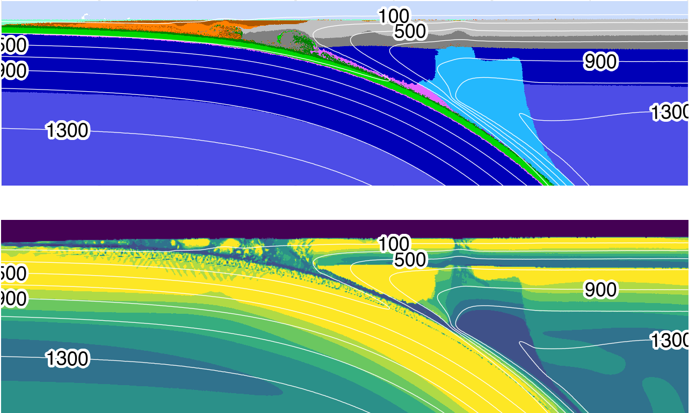

***Figure:*** *Visualization s of standard model cdf78 at 5.05 Ma. (top) Rock type. (bottom) Log10 of viscosity. By 5 Ma, balance is achieved between heat sinking from the upper mantle wedge to lower parts of the mantle and strong advection of heat in the circulating part of the mantle wedge. A feedback has already developed—heat advection inhibits antigorite stabilization to greater depths.*

# Kerswell et al. (2021; G3)

The notions that mechanical coupling in subduction zones regulate important seismic, volcanic, and geodynamic phenomena, and that depths of mechanical coupling may be invariant among diverse subduction zone segments ([Wada & Wang, 2009](https://agupubs.onlinelibrary.wiley.com/doi/abs/10.1029/2009GC002570)), begs the following questions: where, how, and why does mechanical coupling occur along the interface between converging tectonic plates? This study investigates these questions by constructing 64 numerical geodynamic models of oceanic-continental convergent margins. Such a comprehensive suite of numerical models allows us to correlate mechanical coupling depths with thermo-kinematic boundary conditons—ultimately producing an expression for predicting coupling depths in real systems.

The [manuscript](https://agupubs.onlinelibrary.wiley.com/doi/abs/10.1029/2020GC009304) was published in *Geochemistry, Geophysics, Geosystems* on May 30, 2021. You can find the article [here](https://buchanankerswell.com/assets/pdf/kerswell-et-al-coupling-g3-2021.pdf).

## Repository

This repository provides all materials for the manuscript *Backarc Lithospheric Thickness and Serpentine Stability Control Slab-Mantle Coupling Depths in Subduction Zones* (Kerswell et al., 2021; G3)

This repository includes:

- An R script to download all data required to compile the study
- R scripts to run the analyses and reproduce all results and figures
- A Makefile and run.sh script to easily compile the study
- The complete manuscript written in Rmarkdown

This repository is self-contained but requires the following software (all open-source).

## Prerequisite software

### R

This study is written in R. Follow the instructions at [R's homepage](https://www.r-project.org) to download and install the latest release of R on your machine.

## Running the study

Clone (or download) this repository:

```
# Clone this repository
git clone https://github.com/buchanankerswell/kerswell_et_al_coupling.git

# Change into the directory
cd kerswell_et_al_coupling

# Use Makefile to compile
make
```

This will check for required R packages and try to install missing packages automatically.

If all packages are found and available it will proceed to run the study. The study takes about 20 minutes to run on my MacBook Air (M1 8GB, 2020).

## Coauthors:

 - [Matthew Kohn](https://www.google.com/url?sa=t&rct=j&q=&esrc=s&source=web&cd=&cad=rja&uact=8&ved=2ahUKEwj8yqqTw8T5AhWSADQIHaYXAfQQFnoECA4QAQ&url=https%3A%2F%2Fwww.boisestate.edu%2Fearth%2Fstaff-members%2Fmatthew-j-kohn%2F&usg=AOvVaw3-lM9gvqmVRHG-WhSRFOdu) (Boise State University)
 - [Taras Gerya](https://www.google.com/url?sa=t&rct=j&q=&esrc=s&source=web&cd=&cad=rja&uact=8&ved=2ahUKEwjI1eiYw8T5AhViLzQIHdZJDT4QFnoECBMQAQ&url=https%3A%2F%2Ferdw.ethz.ch%2Fen%2Fpeople%2Fprofile.taras-gerya.html&usg=AOvVaw1ZWpP5eVNtfgnNmrhmGcGJ) (ETH Zürich)

## Acknowledgment

The authors thank the Geophysical Fluid Dynamics group at the Institut für Geophysik, ETH Zürich, for their computing resources and invaluable instruction, discussion, and support on the numerical modeling methods. The authors also thank P. Agard, L. Le Pourhiet, and their students at ISTeP, Sorbonne Université, for suggestions on the numerical modelling methods and discussions that greatly enhanced this study. The authors thank the anonymous reviewers for their helpful comments and suggestions, which greatly improved the manuscript. This work was supported by the National Science Foundation grant OISE 1545903 to M. Kohn, S. Penniston-Dorland, and M. Feineman.

## Open Research

All data, code, and relevant information for reproducing this work can be found at [https://github.com/buchanankerswell/kerswell_et_al_coupling](https://github.com/buchanankerswell/kerswell_et_al_coupling), and at [https://osf.io/zjac3/](https://osf.io/zjac3/), the official Open Science Framework data repository. All code is MIT Licensed and free for use and distribution (see license details).

## Abstract:

A key feature of subduction zone geodynamics and thermal structure is the point at which the slab and mantle mechanically couple. This point defines the depth at which traction between slab and mantle begins to drive mantle wedge circulation and also corresponds with a rapid increase in temperature along the slab-mantle interface. Here we consider the effects of the backarc thermal structure and slab thermal parameter on coupling depth using two-dimensional thermomechanical models of oceanic-continental convergent margins. Coupling depth is strongly correlated with backarc lithospheric thickness, and weakly correlated with slab thermal parameter. Slab-mantle coupling becomes significant where weak, hydrous antigorite reacts to form strong, anhydrous olivine and pyroxene along the slab-mantle interface. Highly efficient (predominantly advective) heat transfer in the asthenospheric mantle wedge and inefficient (predominantly conductive) heat transfer in the lithospheric mantle wedge results in competing feedbacks that stabilize the antigorite-out reaction at depths determined primarily by the mechanical thickness of the backarc lithosphere. For subduction zone segments where backarc lithospheric thickness can be inverted from surface heat flow, our results provide a regression model that can be applied with slab thermal parameter to predict coupling depth. Consistently high backarc heat flow in circum-Pacific subduction zones suggests uniformly thin overriding plates likely regulated by lithospheric erosion caused by hydration and melting processes under volcanic arcs. This may also explain a common depth of slab-mantle coupling globally.

## License

MIT License

Copyright (c) 2021 Buchanan Kerswell

Permission is hereby granted, free of charge, to any person obtaining a copy
of this software and associated documentation files (the "Software"), to deal
in the Software without restriction, including without limitation the rights
to use, copy, modify, merge, publish, distribute, sublicense, and/or sell
copies of the Software, and to permit persons to whom the Software is
furnished to do so, subject to the following conditions:

The above copyright notice and this permission notice shall be included in all
copies or substantial portions of the Software.

THE SOFTWARE IS PROVIDED "AS IS", WITHOUT WARRANTY OF ANY KIND, EXPRESS OR
IMPLIED, INCLUDING BUT NOT LIMITED TO THE WARRANTIES OF MERCHANTABILITY,
FITNESS FOR A PARTICULAR PURPOSE AND NONINFRINGEMENT. IN NO EVENT SHALL THE
AUTHORS OR COPYRIGHT HOLDERS BE LIABLE FOR ANY CLAIM, DAMAGES OR OTHER
LIABILITY, WHETHER IN AN ACTION OF CONTRACT, TORT OR OTHERWISE, ARISING FROM,
OUT OF OR IN CONNECTION WITH THE SOFTWARE OR THE USE OR OTHER DEALINGS IN THE
SOFTWARE.
