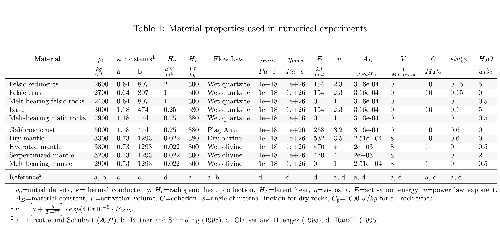
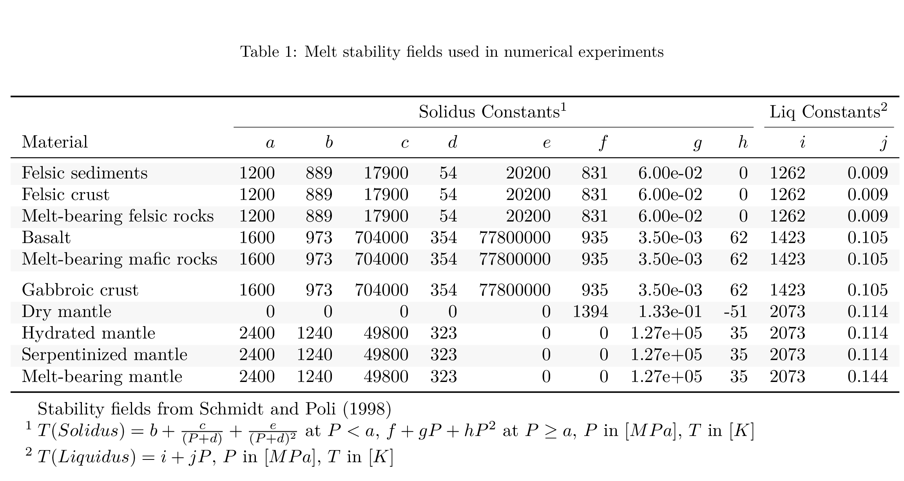
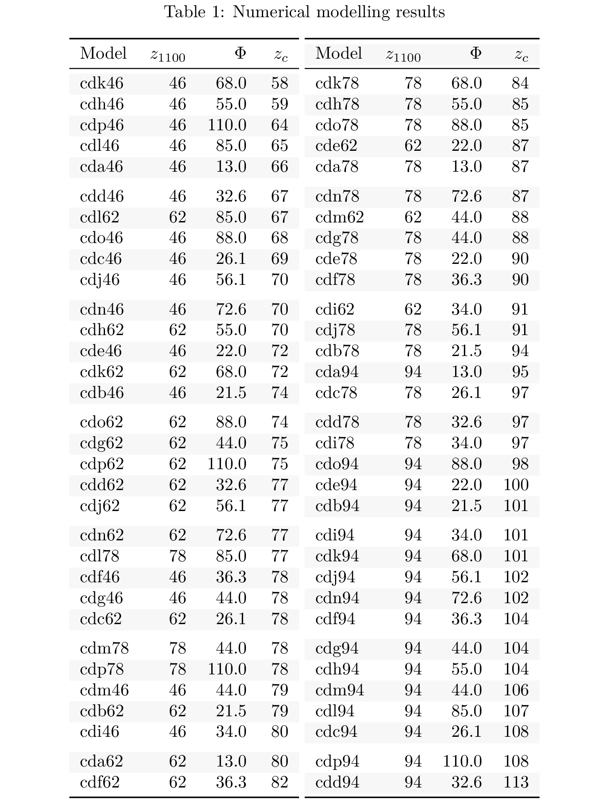
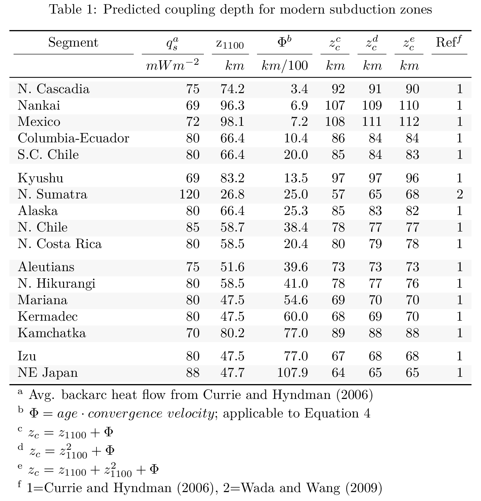

```{r echo=FALSE}
# Some recommended settings. 
knitr::opts_chunk$set(
  echo = FALSE,
  message = F,
  fig.pos = 'h',
  out.extra = "" # To force the use of figure enviroment
)
suppressMessages({
  library(dplyr)
  library(knitr)
  library(kableExtra)
  library(scales)
  load('../data/data.RData')
  load('../data/regressions.RData')
})
```
# Key Points

  - The depth of antigorite destabilization{--, and consequently mechanical coupling,--} is primarily dependent on backarc lithospheric thickness

  - Coupling depths in natural subduction zones can be predicted given slab age, convergence velocity, and backarc lithospheric thickness
  
  - Consistently high backarc heat flow in natural subduction zones may indicate a common depth of mechanical coupling globally at ca. 82 $km$
  
# Abstract

A key feature of subduction zone geodynamics and thermal structure is the point at which the slab and mantle mechanically couple. This point defines the depth at which traction between slab and mantle begins to drive mantle wedge circulation and also corresponds with a {~~major~>rapid~~} increase in temperature along the slab-mantle interface. Here we consider the effects of the backarc thermal structure and slab thermal parameter on coupling depth using two-dimensional thermomechanical models of oceanic-continental convergent margins. Coupling depth is strongly correlated with backarc lithospheric thickness, and weakly correlated with slab thermal parameter. Slab-mantle coupling becomes significant where weak, hydrous antigorite reacts to form strong, anhydrous olivine and pyroxene along the slab-mantle interface. Highly efficient (predominantly advective) heat transfer in the asthenospheric mantle wedge and inefficient (predominantly conductive) heat transfer in the lithospheric mantle wedge results in competing feedbacks that stabilize the antigorite-out reaction at depths determined primarily by the mechanical thickness of the backarc lithosphere. For subduction zone segments where backarc lithospheric thickness can be inverted from surface heat flow, our results provide a regression model that can be applied with slab thermal parameter to predict coupling depth. Consistently high backarc heat flow in circum-Pacific subduction zones suggests uniformly thin overriding plates likely regulated by lithospheric erosion caused by hydration and melting processes under volcanic arcs. This may also explain a common depth of slab-mantle coupling globally.

# Plain language summary for the public and journalists

{~~Subduction is a process where two semi-rigid slabs of earth's outer shell (tectonic plates) converge, and one dives beneath the other into the mantle.~>Subduction is a process where two semi-rigid tectonic plates of earth's outer shell converge, and one dives beneath the other into the mantle.~~} Subduction zones produce the world's largest earthquakes and form new crust through volcanism. Understanding earthquakes and volcanism requires understanding how the two {~~slabs~>plates~~} move with respect to each other. With increasing depth, the sinking {~~slab~>plate~~} transitions from sliding past the overriding {~~slab~>plate~~} to “gripping” the base of the overriding {~~slab~>plate~~}. This gripping (coupling) reduces earthquakes and causes warm rock to flow upwards, enabling volcanism. We used two-dimensional computer simulations of subduction to test what controls the depth of coupling between the {~~slabs~>plates~~}. We found that coupling depth is primarily controlled by the thickness of the overriding {~~slab~>plate~~} and provide an equation to predict coupling depth in real subduction zones. Overriding plates in subduction zones worldwide appear to have similar thicknesses, so coupling depths are also predicted to be similar. Although we do not yet fully understand why the overriding plates are uniformly thin globally, we can assume that this is likely related to {--lithospheric erosion caused by--} hydration and melting under volcanic arcs.

# Introduction

The thermal structure of subduction zones strongly depends on the depth where the subducting slab and overlying mantle transition from mechanically decoupled (moving differentially with respect to each other) to mechanically coupled [moving with the same local velocity, @Furukawa1993; @Peacock1994; @Wada2008]. Coupling drives mantle wedge circulation, and the decoupling-coupling transition defines a rapid increase in temperature along the top of the subducting slab [@Peacock1996]. Based on many observational constraints the depth of slab-mantle coupling has been inferred from numerical models to occur at 70-80 $km$ depth, essentially independent of other parameters including slab age, convergence velocity, and subduction geometry [@Furukawa1993; @Wada2008; @Wada2009]. It is significant that modern subduction zones appear to achieve similar depths of coupling despite their different physical characteristics.

A prescribed slab-mantle coupling depth of 70-80 $km$ has been used as a physical condition in many thermomechanical models [e.g., @Abers2017; @Currie2004; @Syracuse2010; @VanKeken2011; @VanKeken2018; @Wada2012; @Gao2014; @Wilson2014], although different coupling depths apply in other studies [e.g. 40-56 $km$, @England2010; @Peacock1996]. A common coupling depth is attractive for at least two reasons: Firstly, it helps explain the relatively narrow range of sub-arc slab depths [@England2004; @Syracuse2006] as mechanical coupling is expected to be closely associated with the onset of flux melting. Secondly, since mechanical coupling is required to detach and recover rocks from the down-going slab [@Agard2016], a common depth of coupling may also help explain why the maximum pressures recorded by subducted oceanic material worldwide is ca. 2.3-2.5 $GPa$ [roughly 80 $km$, @Agard2009].

Beyond playing a crucial role in subduction zone thermal structure, the location and extent of mechanical coupling along the slab-mantle interface is implicated in a myriad of subduction zone geodynamics [seismicity, metamorphism, volatile fluxes into the mantle wedge, volcanism, {~~slab motion and trench retreat, etc.~>and plate motions~~}, e.g., @Cizkova2013; @Peacock1990; @Peacock1991; @Peacock1993; @Peacock1996; @Peacock1999a; @Hacker2003; @VanKeken2011; @Grove2012; @Gao2017]. Consequently, the mechanics of coupling have been extensively studied and discussed. Coupling fundamentally depends on the strength (viscosity) of materials above, within, and below the slab-mantle interface. In general, high water fluxes due to compaction and dehydration of clays and other hydrous minerals in the shallow forearc mantle wedge, coupled with increases in pressure and temperature, form layers of low viscosity sheet silicates---especially talc and serpentine---that inhibit transmission of shear stress from the slab to the mantle wedge [@Peacock1999a]. The lack of traction along the interface combined with cooling from the subducting slab surface ensures the shallow mantle wedge remains cold and rigid. Experimentally determined flow laws [e.g., {--see summary of--}@Agard2016], petrologic observations [e.g., {--see summary of--}@Agard2016], and geophysical observations [e.g., @Gao2014; @Peacock1999a] all support the plausibility of this conceptual model of subduction interface behavior.

Here we focus on two fundamental questions: 1) What controls the depth of slab-mantle mechanical coupling? 2) How does coupling depth change through time? To address these questions, we use two-dimensional thermomechanical models of subduction to investigate potential correlations between the slab-mantle coupling depth, backarc lithospheric thickness (inverted from backarc heat flow), and slab thermal parameter ($\Phi$). @Wada2009 previously investigated steady-state slab-mantle coupling depths by modelling 17 active subduction zones. Among other parameters, their models specified convergence rate, subduction geometry, thermal structure of incoming and overriding plate, and degree of coupling vs. decoupling with depth along the subduction interface. Notably, their models prescribed the mechanical coupling depth for each subduction zone, did not include mineral reactions that might influence rheologies, and discriminated the best-fit depth based on observed fore-arc heat flow. In our models, we also specify horizontal convergence velocity and thermal structure of the incoming and overriding plates, as one would for modeling a modern system. However, the geometry of the subduction system and (most importantly) the point of mechanical coupling are allowed to evolve independently until they reach steady state. That is, the coupling depth in each of our models {~~is an emergent rather than prescribed feature~>is not a fully determined feature~~}. As in other previous studies [e.g., @Ruh2015], we also include the rheological effect of the dehydration reaction $antigorite \Leftrightarrow olivine + orthopyroxene + H_{2}O$, which drives mechanical coupling by an abrupt viscosity increase with antigorite loss. The position of this reaction along the subduction interface determines the coupling depth.

We quantify the effects of the $\Phi$ and backarc lithospheric thickness on the depth of this reaction using linear regression. We then visualize thermal feedbacks within the system in terms of the distributions of temperature, viscosity, and an effective Pèclet number (the ratio of heat advection to heat conduction). Last, we discuss how these feedbacks stabilize the coupling depth through millions of years of subduction.

# Numerical Modelling Methods

Our models simulated converging oceanic-continental plates, where an ocean basin is being consumed by subduction at a continental margin ([@fig:init]). The {~~core code was~>initial conditions were~~} modified from previous modeling studies of active margins [@Gorczyk2007; @Sizova2010], although slab-mantle coupling was not the focus of their studies. Our approach was to use identical material properties ({~~Table 1~>Tables 1, 2~~}), {~~rheological~>rheologic~~} model, and hydration/melt model as [see Appendix, @Sizova2010]. Our version differed from @Sizova2010 in its initial setup, overall dimension, resolution, the shape of the continental geotherm, the slab dehydration model, and the left boundary condition (origin of the subducting slab). {++These differences are outlined below.++} Sixty-four models were constructed varying convergence rate, subducting plate age, and the lithospheric thickness of the overriding plate ([@fig:params]).


```{r materials}
tibble(
  material = c('Felsic sediments', 'Felsic crust', 'Melt-bearing felsic rocks', 'Basalt', 'Melt-bearing mafic rocks', 'Gabbroic crust', 'Dry mantle', 'Hydrated mantle', 'Serpentinized mantle', 'Melt-bearing mantle'),
  rho = c(2600, 2700, 2400, 3000, 2900, 3000, 3300, 3300, 3200, 2900),
  k.a = c(0.64, 0.64, 0.64, 1.18, 1.18, 1.18, 0.73, 0.73, 0.73, 0.73),
  k.b = c(807, 807, 807, 474, 474, 474, 1293, 1293, 1293, 1293),
  h.r = c(2, 1, 1, 0.25, 0.25, 0.25, 0.022, 0.022, 0.022, 0.022),
  h.l = c(300, 300, 300, 380, 380, 380, 380, 300, 300, 300),
  fl.law = c('Wet quartzite', 'Wet quartzite', 'Wet quartzite', 'Wet quartzite', 'Wet quartzite', 'Plag An$_{75}$', 'Dry olivine', 'Wet olivine', 'Wet olivine', 'Wet olivine'),
  eta.min = rep(1e18, 10),
  eta.max = rep(1e26, 10),
  E = c(154, 154, 0, 154, 0, 238, 532, 470, 470, 0),
  n = c(2.3, 2.3, 1, 2.3, 1, 3.2, 3.5, 4, 4, 1),
  A = c(scientific(1*10^-3.5, digits = 3), scientific(1*10^-3.5, digits = 3), scientific(1*10^-3.5, digits = 3), scientific(1*10^-3.5, digits = 3), scientific(1*10^-3.5, digits = 3), scientific(1*10^-3.5, digits = 3), scientific(1*10^4.4, digits = 3), scientific(1*10^3.3, digits = 3), scientific(1*10^3.3, digits = 3), scientific(1*10^4.4, digits = 3)),
  V = c(0, 0, 0, 0, 0, 0, 8, 8, 8, 8),
  C = c(10, 10, 1, 10, 1, 10, 10, 1, 1, 1),
  sin.phi = c(0.15, 0.15, 0, 0.1, 0, 0.6, 0.6, 0, 0, 0),
  h2o = c(5, 0, 0.5, 5, 0.5, 0, 0, 0.5, 2, 0.5)
) %>% 
  rbind(c('Reference$^2$', 'a, b', 'c', 'c', 'd', 'a', 'a, b', 'd', 'd', 'd', 'a, d', 'a, d', 'a, d', 'a, d', 'a, d', '')) %>% 
  kbl(col.names = c('', '$\\frac{kg}{m^3}$', 'a', 'b', '$\\frac{\\mu W}{m^3}$', '$\\frac{kJ}{kg}$', '', '$Pa\\cdot s$', '$Pa\\cdot s$', '$\\frac{kJ}{mol}$', '', '$\\frac{1}{MPa^{II}s}$', '$\\frac{1}{MPa\\cdot mol}$', '$MPa$', '', '$wt\\%$'),
      caption = 'Material properties used in numerical experiments',
      escape = F,
      booktabs = T,
      format = 'latex') %>% 
  add_header_above(c('Material', '$\\\\rho_0$', '$\\\\kappa$ constants$^1$' = 2, '$H_r$', '$H_L$', 'Flow Law$$', '$\\\\eta_{min}$', '$\\\\eta_{max}$', '$E$', '$n$', '$A_D$', '$V$', '$C$', '$sin(\\\\phi)$', '$H_2O$'), line = T, escape = F) %>% 
  row_spec(10, hline_after = T) %>% 
  kable_styling(latex_options = c("hold_position", "scale_down", "striped")) %>%
  landscape() %>% 
  kable_classic() %>%
  footnote(general = c('$\\\\rho_0$=initial density, $\\\\kappa$=thermal conductivity, $H_r$=radiogenic heat production, $H_L$=latent heat, $\\\\eta$=viscosity, $E$=activation energy, $n$=power law exponent, $A_D$=material constant, $V$=activation volume, $C$=cohesion, $\\\\phi$=angle of internal friction for dry rocks, $C_p$=1000 $J/kg$ for all rock types'),
           number = c('$\\\\kappa = \\\\left[ a + \\\\frac{b}{T+77} \\\\right] \\\\cdot exp(4.0x10^{-5} \\\\cdot P_{MPa})$', 'a=Turcotte and Schubert (2002), b=Bittner and Schmeling (1995), c=Clauser and Huenges (1995), d=Ranalli (1995)'),
           escape = F,
           threeparttable = T,
           general_title = '') %>% 
  as_image(file = '../tables/materials.png', width = 9)
```


<center>


{width='100%'}


</center>


```{r melts}
tibble(
  material = c('Felsic sediments', 'Felsic crust', 'Melt-bearing felsic rocks', 'Basalt', 'Melt-bearing mafic rocks', 'Gabbroic crust', 'Dry mantle', 'Hydrated mantle', 'Serpentinized mantle', 'Melt-bearing mantle'),
  a = c(1200, 1200, 1200, 1600, 1600, 1600, 0, 2400, 2400, 2400),
  b = c(889, 889, 889, 973, 973, 973, 0, 1240, 1240, 1240),
  c = c(17900, 17900, 17900, 704000, 704000, 704000, 0, 49800, 49800, 49800),
  d = c(54, 54, 54, 354, 354, 354, 0, 323, 323, 323),
  e = c(20200, 20200, 20200, 77800000, 77800000, 77800000, 0, 0, 0, 0),
  f = c(831, 831, 831, 935, 935, 935, 1394, 0, 0, 0),
  g = c(0.06, 0.06, 0.06, 0.0035, 0.0035, 0.0035, 0.133, 127000, 127000, 127000),
  h = c(0, 0, 0, 0000062, 0000062, 0000062, -0000051, 0000035, 0000035, 0000035),
  i = c(1262, 1262, 1262, 1423, 1423, 1423, 2073, 2073, 2073, 2073),
  j = c(0.009, 0.009, 0.009, 0.105, 0.105, 0.105, 0.114, 0.114, 0.114, 0.144)
) %>%
  kbl(col.names = c('Material', '$a$', '$b$', '$c$', '$d$', '$e$', '$f$', '$g$', '$h$', '$i$', '$j$'),
      caption = 'Melt stability fields used in numerical experiments',
      escape = F,
      booktabs = T,
      format = 'latex') %>% 
  add_header_above(c('', 'Solidus Constants$^1$' = 8, 'Liq Constants$^2$' = 2), escape = F) %>% 
  kable_styling(latex_options = c("hold_position", "scale_down", "striped")) %>%
  landscape() %>% 
  kable_classic() %>%
  footnote(
    general = c('Stability fields from Schmidt and Poli (1998)'),
    number = c('$T(Solidus)=b+\\\\frac{c}{(P+d)}+\\\\frac{e}{(P+d)^2}$ at $P<a$, $f+gP+hP^2$ at $P\\\\geq a$, $P$ in $[MPa]$, $T$ in $[K]$',
               '$T(Liquidus) = i+jP$, $P$ in $[MPa]$, $T$ in $[K]$'),
    escape = F,
    threeparttable = T,
    general_title = '') %>%
  as_image(file = '../tables/melt.png', width = 9)
```


<center>


{width='100%'}


</center>


## Initial setup and boundary conditions

Our two-dimensional model was 2000 $km$ wide and 300 $km$ deep ([@fig:init]). In the model domain, three governing equations of heat transport, motion, and continuity were discretized and solved using a conservative finite-difference with marker-in-cell approach on a fully staggered grid as outlined in @Gerya2003 [code: I2VIS]. The model resolution was non-uniform with higher resolution (1 $km$ x 1 $km$) in a 600 $km$ wide area surrounding the contact between the ocean basin and continental margin and gradually changing to lower resolution (5 $km$ x 1 $km$, x- and z-directions, respectively) outside of this area. The left and right boundaries were free-slip and thermally {~~insulative~>insulated~~} {~~(Fig. 1a)~>([@fig:init a; @fig:init b])~~}. The implementation of “sticky” air and water allowed for a free topographical surface with a simple linear sedimentation and erosion model. The lower boundary was open to allow for slab penetration and spontaneous slab motion [@Burg2005].


<center>


![Figure 1. Initial model configuration and boundary conditions. (a) A free sedimentation/erosion boundary at the surface is maintained by implementing a layer of “sticky” air and water, and an infinite-like open boundary at the bottom allows for slab penetration. {++The left and right boundaries are free slip and insulative.++} {++The initial material distribution includes 7 $km$ of oceanic crust (2 $km$ basalt, 5 $km$ gabbro), 1 $km$ of oceanic sediments, and 35 $km$ of continental crust, thinning ocean-ward.++} {++(b)++} Oceanic lithosphere is continually created at the left boundary{-- and convergence velocities are imposed at stationary regions far from the trench--}. {++The oceanic geotherm is calculated using a half-space cooling model and the continental geotherm is calculated using a one-dimensional steady-state conductive cooling model to 1300 $^{\circ}C$. The base of the lithosphere is defined mechanically through visualization of viscosity and generally coincides with the 1100 $^{\circ}C$ isotherm ($z_{1100}$).++} {--The left and right boundaries are free slip and insulative.--}{--(b) --}{--The initial material distribution includes 7 $km$ of oceanic crust (2 $km$ basalt, 5 $km$ gabbro), 1 $km$ of oceanic sediments,  and 35 $km$ of continental crust, thinning ocean-ward.--}{++(c)++} The oceanic crust is bent under loading from passive margin sediments, and a weak zone {--(high pore fluid pressure)--} extends from the deflected oceanic crust, through the lithosphere, to help induce subduction.{--(c)--}{--The oceanic geotherm is calculated using a half-space cooling model and the continental geotherm is calculated using a one-dimensional steady-state conductive cooling model to 1300 $^{\circ}C$. The base of the lithosphere is defined mechanically through visualization of viscosity and generally coincides with the 1100 $^{\circ}C$ isotherm ($z_{1100}$).--} {++Convergence velocities are imposed at stationary regions far from the trench.++}](../figs/fig1.png){width='100%' #fig:init}

</center>


A horizontal convergence {~~velocity~>force~~} was applied to both plates in a rectangular region far from the continental margin {~~(Fig. 1a)~>([@fig:init c])~~}. {~~A convergence force and initial weak layer~>An initial weak layer~~}{--(high pore fluid pressure)--} cutting the lithosphere permitted subduction to initiate. The rectangular convergence regions prescribed inside the plates {++applied constant horizontal velocities without deforming the lithosphere by++} {~~maintained a constant viscosity~>maintaining constant viscosities~~} of {~~$\eta = 10^25 Pa\cdot s$~>$\eta = 10^{25}~Pa\cdot s$~~} {--to apply constant horizontal velocities without deforming the lithosphere--}. The subduction angle was not prescribed and was governed by the free-motion of the sinking slab. Similarly, subduction velocity can vary with time in response to extension or shortening of the overriding plate. Therefore, we calculated the slab thermal parameter ($\Phi$) {++for the initial conditions++} as the product of the horizontal convergence velocity ($km/Ma$) and the slab age [$Ma$, c.f. @McKenzie1969]. We use $\Phi$/100 as it is commonly presented in the literature to reduce the thermal parameter to convenient {~~figures~>values~~} ([@fig:params a]).


<center>


![The range of key parameters investigated in this study. (a) Modelled {--slab ages and convergence velocities--} {++thermal parameters range from 13 to 110 $km/100$ and++} broadly reflect {--the middle-range of the global--} {++the++} distribution of {++slab ages and convergence velocities in++} modern subduction zones {--with thermal parameters ranging from 13 to 110 $km/100$--}. Model names include the prefix "cd" for "coupling depth" with {--arbitrarily--} increasing alphabetic suffixes. {++Note that neither axes are continuous.++} (b) Geotherms were constructed using a one-dimensional steady-state conductive cooling model using $T(z=0) = 0~^{\circ}C$ and $q(z=0) = 59,~63,~69,~79~mW/m^2$, and constant radiogenic heating of 1.0 $\mu W/m^3$ for a 35 $km$-thick crust and 0.022 $\mu W/m^3$ for the mantle. The continental geotherms are calculated up to 1300 $^{\circ}$C, with a 0.5 $^{\circ}C/km$ gradient (the mantle adiabat) for higher temperatures.](../figs/fig2.png){#fig:params}

</center>

## Calculating geotherms and defining lithospheric thickness

The oceanic crust was modeled as 1 $km$ of sediment cover overlying 2 $km$ of basalt and 5 $km$ of gabbro {~~(Fig. 1b)~>([@fig:init a])~~}. Oceanic lithosphere was continually made at a pseudo-mid-ocean ridge on the left boundary of the model and an enhanced vertical cooling condition was applied at 200 $km$ from the mid-ocean ridge to adjust for the proper oceanic plate age, and therefore its lithospheric thickness as it enters the trench [@fig:init b, @Agrusta2013]. We used plate ages from 32.6 to 110 $Ma$ and convergence velocities from 40 to 100 $km/Ma$ ([@fig:params a]). This range of slab parameters broadly reflects the middle-range of the modern global subduction system [@Syracuse2006].

The initial continental geotherms were determined by solving the heat flow equation in one-dimension to 1300 $^{\circ}C$ ([@fig:params b]). We assumed a fixed temperature of 0 $^{\circ}C$ at the surface, constant radiogenic heating of 1 $\mu W/m^3$ in the 35 $km$-thick continental crust and 0.022 $\mu W/m^3$ in the mantle, and thermal conductivities of 2.3 $W/mK$ and 3.0 $W/mK$ for the continental crust and mantle, respectively. {~~Below the 1300 $^{\circ}C$ isotherm the temperature increases by 0.5 $^{\circ}C/km$ (the mantle adiabat)~>Temperature increases by 0.5 $^{\circ}C/km$ (the mantle adiabat) below the 1300 $^{\circ}C$ isotherm~~}.

Many studies define the base of the continental lithosphere at the 1300 $^{\circ}C$ isotherm, but it can be determined more accurately from viscosity and strain rate as the model progresses. The mechanical base of the lithosphere in our models generally occurred around the 1100 $^{\circ}C$ isotherm---characterized by a rapid decrease in viscosity and increase in strain rate (Figures A3, A4, & A5). As such, we consider the oceanic and continental lithosphere in this study as mechanical layers {++defined by viscosity, rather than merely temperature++}. For convenience, we refer to the continental lithospheric thickness as $z_{1100}$ because {++of++} its {++general++} correspondence with the 1100 $^{\circ}C$ isotherm {--makes it discernable in figures where we draw isotherms, but do not explicitly visualize viscosity or strain rate--}. {~~To match our modelled range of backarc heat flow, $z_{1100}$ ranged from 46 to 94 $km$ (Fig. 2b)~>Our modelled range of $z_{1100}$ corresponds to backarc surface heat flow of 59, 63, 69, and 79 $mW/m^2$~~}.

## Metamorphic (de)hydration reactions

Our use of Lagrangian markers to store pressure, temperature, and rheology {--corresponding with rock-specific flow laws--} allows for {~~changes to material properties (e.g., viscosity, density, etc.) that can result from metamorphic reactions~>subsequent changes of material properties for rocks undergoing simulated metamorphic reactions~~}. In our models, we focused on dehydration reactions in the slab and the formation and breakdown of antigorite in the mantle wedge. For computational efficiency our models did not solve for thermodynamically stable mineral assemblages to compute water contents for the slab and mantle wedge [e.g., @Connolly2005]. Instead,{-- for the slab,--} we implemented a simple model for gradual dehydration (eclogitization) of {~~the~>oceanic~~} crust, computed as a linear function of depth (lithostatic pressure), with a maximum depth (150 $km$) where the slab was completely dehydrated. This approach effectively simulates a continuous influx of water to the mantle wedge, beginning with compaction and release of connate water at shallow depths, followed by a sequence of reactions consuming major hydrous phases (chlorite, lawsonite, zoisite, chloritoid, talc, amphibole, and phengite) in different parts of the hydrated basaltic crust [@Schmidt1998; @VanKeken2011]. {++We are implicitly assuming slabs of different ages are similarly relseasing water. Older slabs, however, are more likely to carry water to greater depths because water-releasing reactions will be delayed along cold subduction thermal gradients, relative to younger slabs with warmer subduction thermal gradients [@Peacock1996].++}

For the mantle wedge, hydration of strong peridotite to form weak brucite and serpentine along the subduction interface is likely responsible for mechanical decoupling between the slab and the mantle wedge at shallow levels [@Hyndman2003; @Peacock1999a]. If so, noting that brucite breaks down at much lower temperatures than serpentine [@Schmidt1998], the loss of serpentine likely represents the key transition from a weak wedge (and subduction interface) to a strong wedge. Dehydration of serpentine was modelled as an abrupt, discontinuous reaction, {~~which is a good approximation for extremely Mg-rich rocks like peridotites.~>which is a good approximation for near-endmember compositions, like (Mg-rich) peridotites.~~} The P-T conditions of the reaction $antigorite \Leftrightarrow olivine + orthopyroxene + H_{2}O$ were based on the experimentally determined stability field from @Schmidt1998 and implemented into our model using the following equation:


$$\begin{alignedat}{2}
  T_{atg-out}(z) &= 751.50+6.008\times10^{-3}z-3.469\times10^{-8}z^2 && \text{for}~z<63000m \\
  T_{atg-out}(z) &= 1013.2-6.039\times10^{-5}z-4.289\times10{-9}z^2 && \text{for}~z>63000m
 \end{alignedat}$$ {#eq:antstab}

where $z$ is the depth of a marker from the surface in meters and $T$ is temperature in Kelvins. This reaction placement is also consistent to within 25 $^{\circ}C$ with recent experiments [@Shen2015]. Under assumptions of thermodynamic equilibrium, markers whose internal temperature exceeds $T(z)$  spontaneously formed $olivine + orthopyroxene + H_2O$, releasing their crystal-bound water. {++This implementation is common to versions of I2VIS that do not implement thermodynamic computations of  mineral stability [e.g., @Connolly2005].++}

The excess water released by a rock marker was modelled as a fluid particle that migrates through rocks with a velocity defined by pressure gradients{++, plus a constant $10~cm/yr$ vertical component++} [see Appendix, @Faccenda2009]. The fluid particle migrates until it reaches material that can consume an additional amount of water by equilibrium hydration reactions (e.g., [@eq:antstab]). Theoretically, the mantle can store large amounts of water because antigorite is stable at shallow mantle conditions and can contain up to 13 $wt.\%$ water [@Reynard2013]. Thermodynamic models predict 8 $wt.\%$ water in the mantle wedge [@Connolly2005]. However, seismic studies suggest that most forearcs are only partially serpentinized ($<$ 20-40 $\%$), equating to water contents of ca. 3-6 $wt.\%$ [@Abers2017; @Carlson2003]. Therefore we limit mantle wedge hydration to $\leq$ 2 $wt.\% ~H_2O$ and assume any $H_2O$ in excess exits the system through channelized fluid flow [@Davies1999].

## Rheologic Model

{++
Solid-state creep is modelled using experimentally derived temperature-pressure-stress-dependent flow laws in terms of strain rate [@Ranalli1995] by:

$$\eta_{creep} = (\dot{\varepsilon}_{II})^{(1-n)/n}F(A_{D})^{-1/n}exp\left(\frac{E + VP}{nRT}\right)$$ {#eq:flowlaw}

where $\dot{\varepsilon}_{II} = \sqrt{(1/2)\dot{\varepsilon}_{ij}\dot{\varepsilon}_{ij}}$ is the second invariant of the strain rate tensor, $n$, $A_D$, $E$, and $V$ are experimentally determined flow law parameters (Table 1) for the stress  exponent, material constant, activation energy, and activation volume, respectively, and $R$ is the gas constant. $F$ is a dimensionless coefficient depending on the experimental setup (uniaxial, triaxial, or simple shear). Our models limited viscosity for all rocks at $\eta_{min} = 10^{18}~Pa\cdot s$ and $\eta_{max} = 10^{26}~Pa\cdot s$.

An effective visco-plastic rheology is modelled by limiting the effective viscosity according the the Mohr-Coulomb yield criterion [@Ranalli1995] by:++}

$$ \begin{alignedat}{6}
   \sigma_{yield} &= C + Psin(\phi) & \\
   sin(\phi) &= sin(\phi_{dry})\lambda_{fluid} & \\
   \lambda_{fluid} &= 1 - \frac{P_{fluid}}{P} & \\
   \eta_{effective}  &= \eta_{creep} & & & ~\text{for}~ \sigma_{II} < \sigma_{yield} \\
   \eta_{effective}  &= \eta_{plastic} & & & ~\text{for}~ \sigma_{II} \geq \sigma_{yield} \\
   \eta_{plastic}  &\leq \frac{\sigma_{yield}}{2\dot{\varepsilon_{II}}} &
  \end{alignedat} $$ {#eq:rheology}
  
{++where $\sigma_{yield}$ is the plastic strength of the rock, $C$ is cohesion, $\phi$ is the angle of internal friction, $P$ is lithostatic pressure, $P_{fluid}$ is pore-fluid pressure, and $\sigma_{II}$ is the second invariant of the stress tensor (Table 1). [@eq:rheology] states that a rock's yield strength is a function of its cohesive strength, plus the ratio of pore fluid pressure to confining pressure, and if deviatoric stress exceeds the yield strength of a rock, that rock's rheology is defined by $\sigma_{yield}/2\dot{\varepsilon_{II}}$.++}
  
{++Thus, pore-fluid pressure siginificantly affects the geodynamics in regions with wet rocks. Previous studies have found a transition in geodynamic regime for subduction at $0.01 < \lambda_{fluid} < 0.1$ [@Sizova2010; @Gerya2011; @Vogt2012]. Enhanced fluid weakening at $\lambda_{fluid} < 0.01$ promotes weaker slab-mantle mechanical coupling, slab rollback, backarc basin formation, and accretion of seafloor sediments. Diminished fluid weakening at $\lambda_{fluid} > 0.1$ promotes stronger slab-mantle mechanical coupling, compressional tectonics in the backarc, and erosion of material from the upper plate. Increasing $\lambda_{fluid}$ above 0.1 also has the effect of deepening the coupling depth, ultimately resulting in complete slab-mantle mechanical coupling and two-sided subduction at $\lambda_{fluid} = 1$ [@Gerya2008]. $\lambda_{melt}$ has a similar effect, although not as prominent in our models because of low volumes of melt generation ([@fig:comp]). We used $\lambda_{fluid} = 0.003$ and $\lambda_{melt} = 0.003$ as a conservative option, which is sufficiently weak be squarely in a slab rollback regime for the range of modelled slab parameters ([@fig:params]), but not so weak to result in rapid rifting in the backarc.

Note the equivalent rheology of wet mantle and serpentinized mantle in Table 1. Any material using a wet olivine flow law could replace serpentine in our models and the geodynamic implications would not change. Water is ostensibly the only requirement for mechanical decoupling [@Gerya2008]. But transitioning to a mechanically-coupled state is only sensitive to the difference in strength between two materials [@Wada2008]. We focused on serpentine because of the abrupt strength increase during the reaction $antigorite \Leftrightarrow olivine + orthopyroxene + H_{2}O$, after which the rock is modelled using a dry olivine flow law.
++}

## Visualization and determination of coupling depth

For each run ([e.g., @fig:comp]) we made calculations at $\sim$ 10 $Ma$ for surface heat flow ([@fig:comp a]) and visualized rock type ([@fig:comp b; @fig:comp c]), temperature ([@fig:comp d]), viscosity ([@fig:comp e]), {++and++} strain rate ([@fig:comp f]){--, and an effective Pèclet number (detailed below)--}. We chose 10 $Ma$ because changes to the overall dynamics and thermal structure are small after ca. 5 $Ma$ and the additional 5 $Ma$ provides sufficient time for the geodynamics to {~~fully stabilize~>reach quasi-steady state~~} (see Figure A1).


<center>


![Visualization of model cdf with a 78 $km$-thick backarc lithosphere at $\sim$ 10 $Ma$. Arc {~~positions are marked by triangles~>position is marked by a triangle~~}. (a) Surface heat flow calculated at a depth of 2 $km$ beneath the surface{--(see text for explanation)--}. (b) Rock type for the entire model domain. (c) {~~Rock type in the region from the trench to approximately 220 $km$ into the backarc. By 10 $Ma$ a serpentine channel has formed, entraining material from the top of the down-going slab and lubricating the interface between slab and mantle.~>Rock type in the region from the trench to approximately 220 $km$ into the backarc shows a serpentine layer has formed by 10 $Ma$, lubricating the interface between slab and mantle. Melt is conspicuous in the arc region because of low melt volumes and quick extraction. The effects of melting are apparent in (e) and (f).~~} (d) {~~Temperature distribution.~>Temperature distribution shows strong thermal gradients near the coupling point where serpentine becomes unstable.~~} (e) {~~Log viscosity. The viscosity contrast between the slab and serpentinized mantle in the forearc effectively decouples the slab and mantle wedge mechanically, but abruptly diminishes as the principally weak material (antigorite) is removed by reaction.~>Log viscosity shows high contrast between the slab and serpentinized mantle in the forearc and low contrast where serpentine becomes unstable~~} (f) {~~Log strain rate. In the shallow forearc, strain is localized in the weak serpentine channel. At the antigorite-out reaction, strain localization jumps towards the warm core of the mantle wedge. Circulation in the mantle wedge is restricted to beneath the stiff lithosphere.~>Log strain rate shows localized strain in the serpentine layer, which jumps towards the warm core of the mantle wedge where serpentine becomes unstable. Deofrmation in the mantle wedge is restricted to beneath the stiff lithosphere.~~} (g) {--Effective P\'{e}clet number. An effective P\'{e}clet number is the ratio of advective:conductive heat transport, scaled to the local thermal gradients (see text for formulation). “Cooler” colors (blues) vs. “warmer” colors (reds) indicate advection up vs. down the thermal gradient, i.e., high values show advection in the same direction as diffusion. An absolute value between 0 and ~10 (green) indicates much greater efficiency of heat transfer via thermal diffusion than via advection, whereas absolute values greater than ~40 (blues and reds) indicate high efficiency of heat transfer via advection and/or a small local thermal gradient. Note the narrow region of dark red streaming towards the coupling point, indicating high efficiency of heat advection into the coupling region.--} {++ Isotherms increase from 100$^\circ$C to 1300$^\circ$C by 200$^\circ$C increments.++}](../figs/fig3.png){#fig:comp}


</center>


We determined the mechanical coupling depth, $z_c$, by visualizing viscosity at $\sim$ 10 $Ma$ and selecting a node closest to the point where the viscosity contrast between the serpentinized- and non-serpentinized basal mantle wedge diminishes to $<$ 10$^2$ $Pa\cdot s$ ([@fig:comp e]). In this study we assume that the mechanical coupling depth occurs instantaneously and at a single node. However, mechanical coupling in reality must be dispersed across a finite length along the slab-mantle interface. At the resolution of our models, there was a small area (ca. 5x5 $km$ or 5x5 nodes) where $z_c$ could appropriately be determined, giving an uncertainty in our $z_c$ determination on the order of $\pm$ 2.5 $km$.

{>>Remove Péclet number analysis for clarity. Reviewers found it confusing and/or detracting. Consider reformulating to an invariant expression.<<}

# Results

## Coupling depth predictors

Across all 64 numerical models ([@fig:results], Table 3) coupling depth correlates strongly, but not linearly, with increasing backarc lithospheric thickness ({--$z_{1100}$, --}[@fig:biv a]). This correlation is a key result of our experiments. Slab thermal parameter alone does not correlate obviously with coupling depth ([@fig:biv b]). {~~We determined the best fit model by considering standard least squares regressions that include all possible permutations of the variables $z_{1100}$, $z_{1100}^2$, and $\Phi$ (Tables A1, A2):~>We used standard least squares regressions, including all possible permutations of the variables $z_{1100}$, $z_{1100}^2$, and $\Phi$, to formulate a predictive model ([@eq:zc]) for coupling depth. We considered the number of parameters, p value, and $R^2$ in determining the best regression (Tables A1, A2):~~}

$$z_{c} = 4.95\times10^{-3}z_{1100}^2-9.27\times10^{-2}\Phi+63.6$$ {#eq:zc}

where {~~$z$ and $\Phi$ are in $km$~>$z$ is in $km$ and $\Phi$ is in $km/100$~~}. [@eq:zc] permits the prediction of the mechanical coupling depths in modern subduction zones where {~~backarc lithospheric thickness (inverted from backarc heat flow) and slab thermal parameter can be estimated~>$z_{c}$ can be inverted from heat flow and $\Phi$ is estimated~~}. {~~A~>An open-source~~} {--web-based--} application to perform such calculations is available {--for free--} online (see Appendix).


<center>


![{~~Visualized~>Visual~~} table of coupling depth as determined across a range of lithospheric thicknesses and thermal parameters. Note that the thermal parameter axis is not linear. Corresponding {~~experiment is~>experiments are~~} listed along the top of the array. Coupling depth increases systematically with increasing backarc lithospheric thickness (change in grayscale down columns) for all models. Any trend in coupling depth with respect to slab thermal parameter (change in grayscale across rows) is not apparent.](../figs/fig4.png){#fig:results}


</center>


```{r zc.results}
d <- mods %>% 
  arrange(zc) %>% 
  select(model, z1100, phi, zc)
  kable(list(
    d[1:32,],
    d[33:64,]
  ),
  col.names = c('Model', '$z_{1100}$', '$\\Phi$', '$z_c$'),
  caption = 'Numerical modelling results',
  escape = F,
  booktabs = T,
  format = 'latex') %>% 
    kable_styling(latex_options = c("hold_position", "striped")) %>%
    kable_classic() %>%
    as_image(file = '../tables/zc.results.png', width = 9)
```


<center>


{height='100%'}


</center>


<center>


![{~~Single parameter~>Bivariate~~} regressions. (a) Coupling depth vs. thermal parameter {~~. No~>shows no~~} significant correlation {--occurs--} between coupling depth and the slab thermal parameter (the slope is not significantly different than zero). The thermal state of the slab has little effect on coupling depth and cannot be used as a standalone predictor. (b) Coupling depth vs. lithospheric thickness {~~. Coupling depth increases~>shows coupling depth increasing~~} nonlinearly with increasing backarc lithospheric thickness {~~and~>, which~~} is best fit by a {~~cubic~>quadratic~~} curve. The correlation is highly significant (see Tables A1, A2) and explains more than 80% of the variance in coupling depth. Lithospheric thickness alone predicts coupling depth well.](../figs/fig5.png){#fig:biv}


</center>


In a plot of lithospheric thickness vs. slab thermal parameter ([@fig:multiv a]), contours of coupling depth are shallowly sloped, indicating that lithospheric thickness is more important than slab thermal parameter in predicting coupling depth. The misfit between [@eq:zc] and model estimates is normally distributed, indicating an uncertainty in predicted coupling depth of 0 $\pm$ 11 $km$ ([2$\sigma$, @fig:multiv c]). Predicted coupling depth for 17 modern subduction segments where backarc heat flow data are adequate for inverting for lithospheric thickness [Table 4, @fig:multiv b; data from @Wada2009] show a wide range of predicted coupling depths, similar to our model simulations. Predicted coupling depths for modern subduction zones are distributed normally, with a mean of $\sim$ 82 $km$ and variation of $\pm$ 14 $km$ [2$\sigma$ @fig:multiv d].

```{r segs}
segs %>% 
  mutate(ref = c(rep(1, 6), 2, rep(1, 10))) %>% 
  select(segment, qs, z1100, phi, zc.lin, zc.quad1, zc.quad2, ref) %>% 
  mutate('phi' = round(phi, 1), 'zc.lin' = round(zc.lin), 'zc.quad1' = round(zc.quad1), 'zc.quad2' = round(zc.quad2)) %>% 
  kbl(col.names = c('', '$mWm^{-2}$', '$km$', '$km/100$', '$km$', '$km$', '$km$', ''),
      caption = 'Predicted coupling depth for modern subduction zones',
      escape = F,
      booktabs = T,
      format = 'latex') %>%
  add_header_above(c('Segment', '$q_s^a$', 'z_{1100}', '$\\\\Phi^b$', '$z_c^c$', '$z_c^d$', '$z_c^e$', 'Ref$^f$'), escape = F) %>% 
  kable_styling(latex_options = c("hold_position", "striped")) %>%
  kable_classic() %>%
  footnote(alphabet = c('Avg. backarc heat flow from Currie and Hyndman (2006)', '$\\\\Phi=age \\\\cdot convergence~velocity$; applicable to Equation 4',  '$z_c=z_{1100}+\\\\Phi$', '$z_c=z_{1100}^2+\\\\Phi$', '$z_c=z_{1100}+z_{1100}^2+\\\\Phi$', '1=Currie and Hyndman (2006), 2=Wada and Wang (2009)'), escape = F) %>% 
  as_image(file = '../tables/zc.modern.png', width = 9)
```


<center>



</center>


<!-- \appendix -->
<!-- \section{Here is a sample appendix} -->

<!-- \acknowledgments -->

# References
