```{r echo=FALSE}
# Some recommended settings
knitr::opts_chunk$set(
  echo = FALSE,
  message = F,
  fig.pos = 'h',
  out.extra = "", # To force the use of figure enviroment
  fig.align = 'center',
  out.width = '100%'
)
suppressMessages({
  library(dplyr)
  library(purrr)
  library(knitr)
  library(kableExtra)
  library(scales)
  library(pander)
  load('data.RData')
  load('regressions.RData')
})
```

# Introduction

The thermal structure of subduction zones strongly depends on the depth where the subducting slab and overlying mantle transition from mechanically decoupled (moving differentially with respect to each other) to mechanically coupled [moving with the same local velocity, @Furukawa1993; @Peacock1994; @Wada2008]. Coupling drives mantle wedge circulation, and the decoupling-coupling transition defines a rapid increase in temperature along the top of the subducting slab [@Peacock1996]. Based on many observations, the depth of slab-mantle coupling has been inferred from numerical models to occur at 70-80 $km$ depth, essentially independent of other parameters including slab age, convergence velocity, and subduction geometry [@Furukawa1993; @Wada2008; @Wada2009]. It is significant that modern subduction zones appear to achieve similar depths of coupling despite their different physical characteristics.

A prescribed slab-mantle coupling depth of 70-80 $km$ has been used as a physical condition in many thermomechanical models [e.g., @Abers2017; @Currie2004; @Syracuse2010; @VanKeken2011; @VanKeken2018; @Wada2012; @Gao2014; @Wilson2014], although different coupling depths apply in other studies [e.g. 40-56 $km$, @England2010; @Peacock1996]. A common coupling depth is attractive for at least two reasons: Firstly, it helps explain the relatively narrow range of sub-arc slab depths [@England2004; @Syracuse2006] as mechanical coupling is expected to be closely associated with the onset of flux melting. Secondly, since mechanical coupling is required to detach and recover rocks from the down-going slab [@Agard2016], a common depth of coupling may also help explain why the maximum pressures recorded by subducted oceanic material worldwide is ca. 2.3-2.5 $GPa$ [roughly 80 $km$, @Agard2009].

Beyond playing a crucial role in subduction zone thermal structure, the location and extent of mechanical coupling along the slab-mantle interface is implicated in a myriad of subduction zone geodynamics [seismicity, metamorphism, volatile fluxes into the mantle wedge, volcanism, and plate motions, e.g., @Cizkova2013; @Peacock1990; @Peacock1991; @Peacock1993; @Peacock1996; @Peacock1999a; @Hacker2003; @VanKeken2011; @Grove2012; @Gao2017]. Consequently, the mechanics of coupling have been extensively studied and discussed. Coupling fundamentally depends on the strength (viscosity) of materials above, within, and below the slab-mantle interface. In general, high water fluxes due to compaction and dehydration of clays and other hydrous minerals in the shallow forearc mantle wedge, coupled with increases in pressure and temperature, form layers of low viscosity sheet silicates---especially talc and serpentine---that inhibit transmission of shear stress from the slab to the mantle wedge [@Peacock1999a]. The lack of traction along the interface combined with cooling from the subducting slab surface ensures the shallow mantle wedge remains cold and rigid. Experimentally determined flow laws [e.g., @Agard2016], petrologic observations [e.g., @Agard2016], and geophysical observations [e.g., @Gao2014; @Peacock1999a] all support the plausibility of this conceptual model of subduction interface behavior.

Here we focus on two fundamental questions: 1) What controls the depth of slab-mantle mechanical coupling? 2) How does coupling depth change through time? To address these questions, we use two-dimensional thermomechanical models of subduction to investigate potential correlations between the slab-mantle coupling depth, backarc lithospheric thickness (inverted from backarc heat flow), and slab thermal parameter ($\Phi$). @Wada2009 previously investigated steady-state slab-mantle coupling depths by modelling 17 active subduction zones. Among other parameters, their models specified convergence rate, subduction geometry, thermal structure of incoming and overriding plate, and degree of coupling vs. decoupling with depth along the subduction interface. Notably, their models prescribed the mechanical coupling depth for each subduction zone, did not include mineral reactions that might influence rheologies, and discriminated the best-fit depth based on observed fore-arc heat flow. In our models, we also specify horizontal convergence velocity and thermal structure of the incoming and overriding plates, as one would for modeling a modern system. However, the geometry of the subduction system and (most importantly) the point of mechanical coupling are allowed to evolve independently until they reach steady state. That is, the coupling depth in each of our models is not a fully determined feature but rather a spontaneous model outcome. As in other previous studies [e.g., @Ruh2015], we also include the rheological effect of the dehydration reaction $antigorite \allowbreak \Leftrightarrow olivine + orthopyroxene + H_{2}O$, which drives mechanical coupling by an abrupt viscosity increase with antigorite loss. The position of this reaction along the subduction interface determines the coupling depth.

We quantify the effects of $\Phi$ and backarc lithospheric thickness on the depth of this reaction using linear regression. We then visualize thermal feedbacks within the system in terms of the distributions of temperature, viscosity, and mantle flow velocity. Last, we discuss how feedbacks stabilize the coupling depth through millions of years of subduction.

# Numerical Modelling Methods

Our models simulated converging oceanic-continental plates, where an ocean basin is being consumed by subduction at a continental margin ([@fig:init]). The initial conditions were modified from previous modeling studies of active margins [@Sizova2010; @Gorczyk2007], although slab-mantle coupling was not the focus of their studies. Our approach was to use identical material properties (Tables \ref{tab:materials}, \ref{tab:melts}), rheologic model, and hydration/melt model (see Appendix) as @Sizova2010. Our version differed from @Sizova2010 in its initial setup, overall dimension, resolution, the shape of the continental geotherm, the slab dehydration model, and the left boundary condition (origin of the subducting slab). These differences are outlined below. Sixty-four models were constructed with varying convergence rate, subducting plate age, and the lithospheric thickness of the overriding plate ([@fig:params]).

```{r init, out.width='100%', fig.cap='Initial model configuration and boundary conditions. (a) A free sedimentation/erosion boundary at the surface is maintained by implementing a layer of "sticky" air and water, and an infinite-like open boundary at the bottom allows for slab penetration. The left and right boundaries are free slip and insulating. The initial material distribution includes 7 $km$ of oceanic crust (2 $km$ basalt, 5 $km$ gabbro), 1 $km$ of oceanic sediments, and 35 $km$ of continental crust, thinning ocean-ward. (b) Oceanic lithosphere is continually created at the left boundary. The oceanic geotherm is calculated using a half-space cooling model and the continental geotherm is calculated using a one-dimensional steady-state conductive cooling model to 1300 $^{\\circ}C$. The base of the lithosphere is defined mechanically through visualization of viscosity and generally coincides with the 1100 $^{\\circ}C$ isotherm ($z_{1100}$). (c) The oceanic crust is bent under loading from passive margin sediments, and a weak zone extends from the deflected oceanic crust, through the lithosphere, to help induce subduction. Convergence velocities are imposed at stationary regions far from the trench. Rock type colors are given in Table \\ref{tab:rock.type}.'}
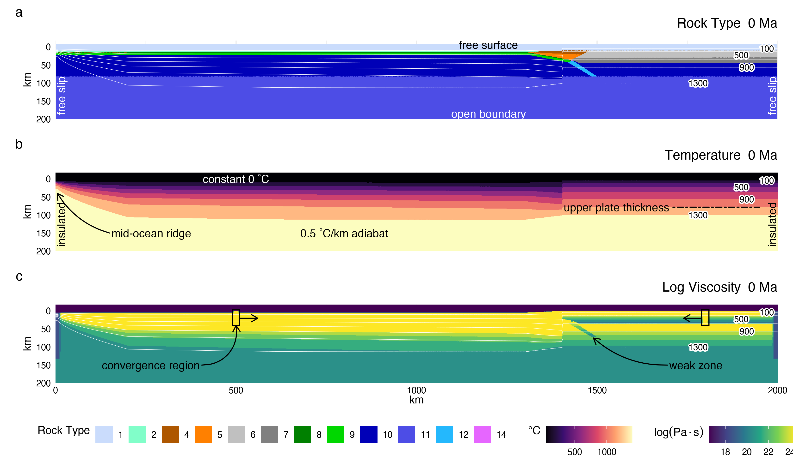
```

```{r materials}
tibble(
  material = c('Felsic sediments', 'Felsic crust', 'Oceanic crust', 'Dry mantle', 'Hydrated mantle', 'Serpentinized mantle'),
  fl.law = c('Wet quartzite', 'Wet quartzite', 'Plag An$_{75}$', 'Dry olivine', 'Wet olivine', 'Serpentine'),
  h = c('', '', '', 0.001, 0.001, ''),
  m = c('', '', '', 2.5, 2.5, ''),
  n = c(2.3, 2.3, 3.2, 3.5, 3, 3.8),
  A = c(scientific(1.97*10^17, digits = 3), scientific(1.97*10^17, digits = 3), scientific(4.8*10^22, digits = 3), '', '', scientific(3.21*10^36)),
  A.diff = c('', '', '', scientific(8.7*10^15, digits = 3), scientific(5.3*10^15, digits = 3), ''),
  A.disl = c('', '', '', scientific(3.5*10^22, digits = 3), scientific(2.0*10^18, digits = 3), ''),
  V = c(scientific(3*10^-6), scientific(3*10^-6, digits = 2), scientific(8*10^-6, digits = 2), '', '', scientific(3.2*10^-6, digits = 2)),
  V.diff = c('', '', '', scientific(4*10^-6), scientific(4*10^-6), ''),
  V.disl = c('', '', '', scientific(20*10^-6), scientific(10*10^-6), ''),
  E = c(scientific(1.54*10^5, digits = 3), scientific(1.54*10^5, digits = 3), scientific(2.38*10^5, digits = 3), '', '', scientific(8.9*10^3, digits = 3)),
  E.diff = c('', '', '', scientific(3.0*10^5, digits = 3), scientific(2.4*10^5, digits = 3), ''),
  E.disl = c('', '', '', scientific(5.4*10^5, digits = 3), scientific(4.3*10^5, digits = 3), ''),
  sigma.cr = c(scientific(3*10^4), scientific(3*10^4), scientific(3*10^4), '', '', scientific(3*10^6)),
  C = c(scientific(1*10^6), scientific(1*10^6), scientific(0.3*10^6), scientific(1*10^6), scientific(1*10^6), scientific(1*10^6)),
  mu0 = c(0.2, 0.6, 0.6, 0.6, 0.6, 0.2),
  mu1 = c(0.1, 0.3, 0.2, 0.3, 0.3, 0.1),
) %>%
  rbind(c('Reference$^1$', 'b, c, d', 'd', 'd', 'b, c, d', 'b, c', 'd', 'd', 'b, c', 'd', 'd', 'b, c', 'd', 'd', 'b, c', 'a', '', '')) %>%
  kbl(col.names = c('', '', '$m$', '', '', '$Pa^n s$', '$s^{-1}$', '$s^{-1}$', '$\\frac{J}{Pa\\cdot mol}$', '$\\frac{J}{Pa\\cdot mol}$', '$\\frac{J}{Pa\\cdot mol}$', '$\\frac{J}{mol}$', '$\\frac{J}{mol}$', '$\\frac{J}{mol}$', '$Pa$', '$Pa$', '', ''),
      caption = 'Rheologic parameters used in numerical experiments',
      escape = F,
      booktabs = T,
      format = 'latex') %>%
  add_header_above(c('Material', 'Flow Law', '$h$', '$m$', '$n$', '$A$', '$A_{diff}$', '$A_{disl}$', '$V$', '$V_{diff}$', '$V_{disl}$', '$E$', '$E_{diff}$', '$E_{disl}$', '$\\\\sigma_{cr}$', '$C$', '$\\\\mu_0$', '$\\\\mu_1$'), line = T, escape = F) %>%
  row_spec(6, hline_after = T) %>%
  kable_styling(latex_options = c("scale_down", "striped")) %>%
  landscape() %>%
  kable_classic() %>%
  footnote(general = c('$h$=grain size, $m$=grain size exponent, $n$=stress exponent, $A$=material constant, $V$=activation volume, $E$=activation energy, $\\\\sigma_{cr}$=critical stress for dislocation creep, $C$=compressive strength at $P$=0, $\\\\mu_{0,1}$=initial and final internal friction coefficient, $\\\\mu_0=\\\\mu_1=0$ for melt-bearing rocks'),
           number = c('a=Turcotte \\\\& Schubert (2002), b=Ranalli (1995), c=Hilairet et al. (2007), d=Karato \\\\& Wu (1993)'),
           escape = F,
           threeparttable = T,
           general_title = '')
  # as_image(file = '../tables/materials.png', width = 9)
```

## Initial setup and boundary conditions

Our two-dimensional model was 2000 $km$ wide and 300 $km$ deep ([@fig:init]). In the model domain, three governing equations of heat transport, motion, and continuity were discretized and solved using a conservative finite-difference with marker-in-cell approach on a fully staggered grid (code: `I2VIS`) as outlined in @Gerya2003. The model resolution was non-uniform with higher resolution (1 $km$ x 1 $km$) in a 600 $km$ wide area surrounding the contact between the ocean basin and continental margin and gradually changing to lower resolution (5 $km$ x 1 $km$, x- and z-directions, respectively) outside of this area. The left and right boundaries were free-slip and thermally insulating ([@fig:init]a, b). The implementation of "sticky" air and water allowed for a free topographical surface with a simple linear sedimentation and erosion model. The lower boundary was open to allow for slab penetration and spontaneous slab motion [@Burg2005].

```{r rock.type}
d <- tibble(
  type = c(seq(0, 19, 1), seq(23, 31, 1), seq(34, 38, 1)),
  name = c('Air', 'Water', 'Sediments', 'Sediments', 'Sediments', 'Felsic Crust', 'Felsic Crust', 'Basalt', 'Gabbro', 'Dry Mantle', 'Dry Mantle', 'Hydrated Mantle', 'Depleted Mantle', 'Serpentinized Mantle', 'Mantle Residue', 'Quenched Sediments', 'Quenced Basalt from Basalt', 'Quenched Basalt from Gabbro', 'Quenched Basalt from Mantle', 'Dry Lower-Density Mantle', 'Molten Sediments', 'Molten Sediments', 'Molten Felsic Crust', 'Molten Felsic Crust', 'Molten Basalt', 'Molten Basalt', 'Molten Dry Mantle', 'Molten Dry Mantle', 'Molten Dry Mantle', 'Molten Hydrated Mantle', 'Molten Quenched Sediments', 'Molten Basalt from Basalt', 'Molten Basalt from Gabbro', 'Molten Basalt from Mantle')
)
list(d[1:17,], d[18:34,]) %>% kable(col.names = c('Number', 'Rock Type'),
        caption = 'Key for rock types used in model visualizations',
        escape = F,
        booktabs = T,
        format = 'latex') %>%
  kable_styling(latex_options = c("striped"), font_size = 8) %>%
  kable_classic()
  # as_image(file = '../tables/rock.types.png', width = 9)
```

A horizontal convergence force was applied to both plates in a rectangular
region far from the continental margin ([@fig:init]c). An initial weak layer cutting the lithosphere permitted subduction to initiate. The rectangular convergence regions prescribed inside the plates applied constant horizontal velocities without deforming the lithosphere by maintaining constant viscosities of $\eta = 10^{25}~Pa\cdot s$. The subduction angle was not prescribed and was governed by the free-motion of the sinking slab. Similarly, subduction velocity can vary with time in response to extension or shortening of the overriding plate. Therefore, we calculated the slab thermal parameter ($\Phi$) for the initial conditions as the product of the horizontal convergence velocity ($km/Ma$) and the slab age [$Ma$, c.f. @McKenzie1969]. We use $\Phi$/100 as it is commonly presented in the literature to reduce the thermal parameter to convenient values ([@fig:params]a).

```{r params, out.width='100%', fig.cap='The range of key parameters investigated in this study. (a) Modelled thermal parameters range from 13 to 110 $km/100$ and broadly reflect the distribution of slab ages and convergence velocities in modern subduction zones. Model names include the prefix "cd" for "coupling depth" with increasing alphabetic suffixes. Note that neither axes are continuous. (b) Geotherms were constructed using a one-dimensional steady-state conductive cooling model using $T(z$=$0)$=$0\\ ^{\\circ}C$ and $q(z$=$0)$=$59,\\ 63,\\ 69,\\ 79\\ mW/m^{2}$, and constant radiogenic heating of 1.0 $\\mu W/m^{3}$ for a 35 $km$-thick crust and 0.022 $\\mu W/m^{3}$ for the mantle. The continental geotherms are calculated up to 1300 $^{\\circ}$C, with a 0.5 $^{\\circ}C/km$ gradient (the mantle adiabat) for higher temperatures.'}
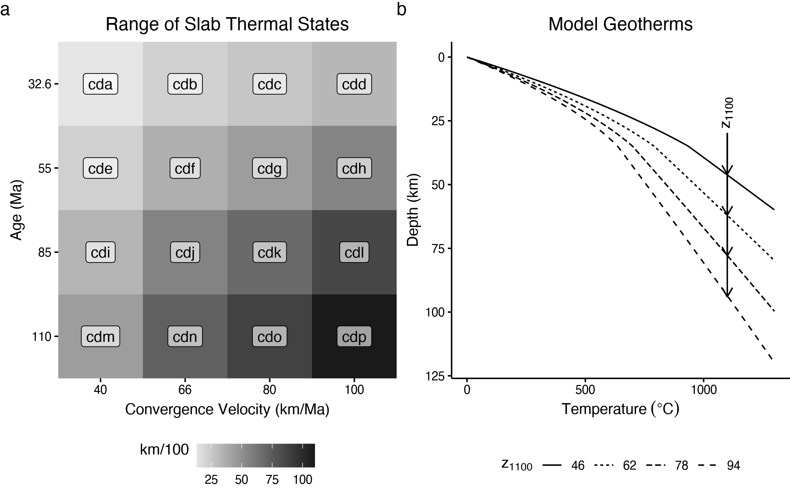
```

```{r melts}
tibble(
  material = c('Felsic sediments', 'Felsic crust', 'Oceanic Crust', 'Dry mantle', 'Hydrated mantle', 'Serpentinized mantle'),
  a = c(1200, 1200, 1600, 0, 2400, 2400),
  b = c(889, 889, 973, 0, 1240, 1240),
  c = c(scientific(1.79*10^4, digits = 3), scientific(1.79*10^4, digits = 3), scientific(7.04*10^5, digits = 3), 0, scientific(4.98*10^4, digits = 3), scientific(4.98*10^4, digits = 3)),
  d = c(54, 54, 354, 0, 323, 323),
  e = c(scientific(2.02*10^4, digits = 3), scientific(2.02*10^4, digits = 3), scientific(7.78*10^7, digits = 3), 0, 0, 0),
  f = c(831, 831, 935, 1394, 0, 0),
  g = c(0.06, 0.06, 0.0035, 0.133, 127000, 127000),
  h = c(0, 0, 0000062, -0000051, 0000035, 0000035),
  i = c(1262, 1262, 1423, 2073, 2073, 2073),
  j = c(0.009, 0.009, 0.105, 0.114, 0.114, 0.114)
) %>%
  kbl(col.names = c('Material', '$a$', '$b$', '$c$', '$d$', '$e$', '$f$', '$g$', '$h$', '$i$', '$j$'),
      caption = 'Melting curves used in numerical experiments',
      escape = F,
      booktabs = T,
      format = 'latex') %>%
  add_header_above(c('', 'Solidus Constants$^1$' = 8, 'Liq Constants$^2$' = 2), escape = F) %>%
  kable_styling(latex_options = c("scale_down", "striped")) %>%
  kable_classic() %>%
  footnote(
    general = c('After phase diagrams from Schmidt \\\\& Poli (1998)'),
    number = c('$T(Solidus)=b+\\\\frac{c}{(P+d)}+\\\\frac{e}{(P+d)^2}$ at $P<a$, $f+gP+hP^2$ at $P\\\\geq a$, $P$ in $[MPa]$, $T$ in $[K]$',
               '$T(Liquidus) = i+jP$, $P$ in $[MPa]$, $T$ in $[K]$'),
    escape = F,
    threeparttable = T,
    general_title = '')
  # as_image(file = '../tables/melt.png', width = 9)
```

## Calculating geotherms and defining lithospheric thickness

The oceanic crust was modeled as 1 $km$ of sediment cover overlying 2 $km$ of basalt and 5 $km$ of gabbro ([@fig:init]a). Oceanic lithosphere was continually made at a pseudo-mid-ocean ridge on the left boundary of the model ([@fig:init]b) and an enhanced vertical cooling condition was applied at 200 $km$ from the mid-ocean ridge to adjust for the proper oceanic plate age, and therefore its lithospheric thickness as it enters the trench [@Agrusta2013]. We used plate ages from 32.6 to 110 $Ma$ and convergence velocities from 40 to 100 $km/Ma$ ([@fig:params]a). This range of slab parameters broadly reflects the middle-range of the modern global subduction system [@Syracuse2006].

The initial continental geotherms were determined by solving the heat flow equation in one-dimension to 1300 $^{\circ}C$ ([@fig:params]b). We assumed a fixed temperature of 0 $^{\circ}C$ at the surface, constant radiogenic heating of 1 $\mu W/m^{3}$ in the 35 $km$-thick continental crust and 0.022 $\mu W/m^{3}$ in the mantle, and thermal conductivities of 2.3 $W/mK$ and 3.0 $W/mK$ for the continental crust and mantle, respectively. Above, 1300 $^{\circ}C$, temperature was assumed to increase by 0.5 $^{\circ}C/km$ (the mantle adiabat).

Many studies define the base of the continental lithosphere at the 1300 $^{\circ}C$ isotherm, but it can be determined more accurately from viscosity and strain rate as the model progresses. The mechanical base of the lithosphere in our models generally occurred around the 1100 $^{\circ}C$ isotherm---characterized by a rapid decrease in viscosity and increase in strain rate ([@fig:cdfstep1; @fig:cdfstep2; @fig:cdfstep3]). As such, we consider the oceanic and continental lithosphere in this study as mechanical layers defined by viscosity, rather than merely temperature. For convenience, we refer to the continental lithospheric thickness as $z_{1100}$ because of its general correspondence with the 1100 $^{\circ}C$ isotherm. Our modelled range of $z_{1100}$ corresponds to backarc surface heat flow of 59, 63, 69, and 79 $mW/m^{2}$.

## Metamorphic (de)hydration reactions

Our use of Lagrangian markers to store pressure, temperature, and rheology allows for subsequent changes of material properties for rocks undergoing simulated metamorphic reactions. In our models, we focused on dehydration reactions in the slab and the formation and breakdown of antigorite in the mantle wedge. For computational efficiency our models did not solve for thermodynamically stable mineral assemblages to compute water contents for the slab and mantle wedge [e.g., @Connolly2005]. Instead, we implemented a simple model for gradual dehydration (eclogitization) of oceanic crust, computed as a linear function of depth (lithostatic pressure), with a maximum depth (150 $km$) where the slab was completely dehydrated. This approach effectively simulates a continuous influx of water to the mantle wedge, beginning with compaction and release of connate water at shallow depths, followed by a sequence of reactions consuming major hydrous phases (chlorite, lawsonite, zoisite, chloritoid, talc, amphibole, and phengite) in different parts of the hydrated basaltic crust [@Schmidt1998; @VanKeken2011]. We implicitly assume slabs of different ages release water similarly. Older slabs, however, should carry water to greater depths because water-releasing reactions will be delayed along cold subduction thermal gradients, relative to younger slabs with warmer subduction thermal gradients [@Peacock1996].

For the mantle wedge, hydration of strong peridotite to form weak brucite and serpentine along the subduction interface is likely responsible for mechanical decoupling between the slab and the mantle wedge at shallow levels [@Hyndman2003; @Peacock1999a]. If so, noting that brucite breaks down at much lower temperatures than serpentine [@Schmidt1998], the loss of serpentine likely represents the key transition from a weak wedge (and subduction interface) to a strong wedge. Dehydration of serpentine was modelled as an abrupt, discontinuous reaction, which is a good approximation for near-endmember compositions, like (Mg-rich) peridotites. The P-T conditions of the reaction $antigorite \Leftrightarrow olivine + orthopyroxene + H_{2}O$ were based on the experimentally determined stability field from @Schmidt1998 and implemented into our model using the following equation:

$$\begin{aligned}
  T_{atg-out}(z) &= 751.50+6.008\times10^{-3}z-3.469\times10^{-8}z^2 & & for~z<63000m \\
  T_{atg-out}(z) &= 1013.2-6.039\times10^{-5}z-4.289\times10{-9}z^2 & & for~z>63000m
 \end{aligned}$$ {#eq:antstab}

where $z$ is the depth of a marker from the surface in meters and $T$ is temperature in Kelvins. This reaction placement is also consistent to within 25 $^{\circ}C$ with recent experiments [@Shen2015]. Under assumptions of thermodynamic equilibrium, markers whose internal temperature exceeds $T(z)$ spontaneously formed $olivine + orthopyroxene + H_{2}O$, releasing their crystal-bound water. This implementation is common to versions of I2VIS that do not implement thermodynamic computations of mineral stability [e.g., @Connolly2005].

The excess water released by a rock marker was modelled as a fluid particle that migrates through moving rocks with a relative velocity defined by local pressure gradients, scaled by a 10 $cm/yr$ vertical percolation velocity corresponding to a purely lithostatic pressure gradient in the mantle [see Appendix, @Faccenda2009]. The fluid particle migrates until it reaches material that can consume an additional amount of water by equilibrium hydration reactions (e.g., [@eq:antstab]). Theoretically, the mantle can store large amounts of water because antigorite is stable at shallow mantle conditions and can contain up to 13 $wt.\%$ water [@Reynard2013]. Thermodynamic models predict 8 $wt.\%$ water in the mantle wedge [@Connolly2005]. However, seismic studies suggest that most forearcs are only partially serpentinized ($<$ 20-40 $\%$), equating to water contents of ca. 3-6 $wt.\%$ [@Abers2017; @Carlson2003]. Therefore we limit mantle wedge hydration to $\leq$ 2 $wt.\%\ H_{2}O$ and assume any $H_{2}O$ in excess exits the system through channelized fluid flow [@Davies1999].

## Rheologic Model

Contributions from dislocation and diffusion creep flow laws are taken into account by computing a composite rheology for ductile rocks, $\eta_{creep}$:

$$\begin{aligned}\frac{1}{\eta_{creep}} = \frac{1}{\eta_{diff}} + \frac{1}{\eta_{disl}}\end{aligned}$$ {#eq:ductile}

$\eta_{diff}$ and $\eta_{disl}$ are effective viscosities for diffusion and dislocation creep, respectively.

For the crust and serpentinized mantle, $\eta_{diff}$ and $\eta_{disl}$ are computed as:

$$\begin{aligned}\eta_{diff} &= \frac{A}{2\sigma_{cr}^{n - 1}}\exp\left( \frac{E + PV}{RT} \right) \\\\
\eta_{disl} &= \frac{1}{2}A^{\frac{1}{n}}\exp\left( \frac{E + PV}{nRT} \right){\dot{\varepsilon}}_{II}^{\frac{1}{n} - 1}\end{aligned}$$ {#eq:crust}

where $R$ is gas constant, $P$ is pressure, $T$ is temperature (in $K$), ${\dot{\varepsilon}}_{II} = \sqrt{1/2{({\dot{\varepsilon}}_{ij})}^{2}}$ is the square root of the second invariant of the strain rate tensor, $\sigma_{cr}$ is the assumed diffusion-dislocation transition stress, and $A$, $E$, $V$ and $n$ are the material constant, activation energy, activation volume, and stress exponent, respectively [Table \ref{tab:materials}, @Hilairet2007; @Ranalli1995].

For the mantle, $\eta_{diff}$ and $\eta_{disl}$ are computed as [@Karato1993]:

$$\begin{aligned}\eta_{diff} &= \frac{G}{2A_{diff}}\left( \frac{h}{b} \right)^{\frac{m}{n}}\exp\left( \frac{E_{diff} + PV_{diff}}{RT} \right) \\\\
\eta_{disl} &= \frac{G}{2A_{disl}^{\frac{1}{n}}}\exp\left( \frac{E_{disl} + PV_{disl}}{nRT} \right){\dot{\varepsilon}}_{II}^{\frac{1}{n} - 1}\end{aligned}$$ {#eq:mantle}

where $b$=$5\times10^{-10}$ $m$ is Burgers vector, $G$=$8\times10^{10}$ $Pa$ is shear modulus, $h$ is the assumed grain size, $m$ is the grain size exponent, and the other flow law parameters are given in Table \ref{tab:materials}. Our models limited viscosity for all rocks at $\eta_{min} = 10^{17}\ Pa \cdot s$ and $\eta_{max} = 10^{25}\ Pa \cdot s$.

The ductile rheology, $\eta_{creep}$, is combined with a brittle (plastic) rheology to yield an effective viscous-plastic rheology using the following upper limit for the ductile viscosity:

$$\begin{aligned}\eta_{creep}\ \  &\leq \frac{C + \mu P}{2{\dot{\varepsilon}}_{II}} \\
\mu\  &= \ \mu_{0} - \gamma\mu_{\gamma} & & for~~\gamma \leq \gamma_0 0 \\
\mu &= \mu_1 & & for~~\gamma > \gamma_0 \\
\gamma &= \int_{}^{}\sqrt{\frac{1}{2}{({\dot{\varepsilon}}_{ij(plastic)})}^{2}}dt\end{aligned}$$ {#eq:plastic}

where $\mu$ is the internal friction coefficient, ($\mu_0$ and $\mu_1$ are the initial and final internal friction coefficients, respectively, Table \ref{tab:materials}), $\mu_\gamma = (\mu_0 - \mu_1)/\gamma_0$ is the fault weakening rate with integrated plastic strain, $\gamma$ ($\gamma_0$=1 is the upper strain limit for fracture-related weakening), $C$ is the rock compressive strength at $P$=0 (Table \ref{tab:materials}), $t$ is time ($s$), and ${\dot{\varepsilon}}_{ij(plastic)}$ is the plastic strain rate tensor.

## Visualization and determination of coupling depth

For each run (e.g., [@fig:comp]) we made calculations at $\sim$ 10 $Ma$ for surface heat flow ([@fig:comp]a), rock type ([@fig:comp]b, c), temperature ([@fig:comp]d), viscosity ([@fig:comp]e), strain rate ([@fig:comp]f), shear heating ([@fig:comp]g), and flow velocity ([@fig:comp]h). We chose 10 $Ma$ because changes to the overall dynamics and thermal structure are small after ca. 5 $Ma$ and the additional 5 $Ma$ provides sufficient time for the geodynamics to reach quasi-steady state (see [@fig:antdepth]).

We determined the mechanical coupling depth, $z_{c}$, by visualizing viscosity at $\sim$ 10 $Ma$ and selecting a node closest to the point where the viscosity contrast between the serpentinized- and non-serpentinized basal mantle wedge diminishes to $<$ 10$^{2}$ $Pa \cdot s$ ([@fig:comp]e). In this study we assume that the mechanical coupling depth occurs instantaneously and at a single node. However, mechanical coupling in reality must be dispersed across a finite length along the slab-mantle interface. At the resolution of our models, there was a small area (ca. 5x5 $km$ or 5x5 nodes) where $z_{c}$ could appropriately be determined, giving an uncertainty in our $z_{c}$ determination on the order of $\pm$ 2.5 $km$.

```{r comp, out.width='100%', fig.cap='Visualization of model cdf with a 78 $km$-thick backarc lithosphere at $\\sim$ 10 $Ma$. (a) Surface heat flow calculated at a depth of 2 $km$ beneath the surface. (b) Rock type for the entire model domain. (c) Rock type in the region from the trench to approximately 220 $km$ into the backarc shows a serpentine layer (pink) lubricating the interface between slab and mantle by 10 $Ma$. Melt is inconspicuous in the arc region because of low melt volumes and quick extraction. The effects of melting are more apparent in viscosity (e) and strain rate (f). (d) Temperature distribution shows strong thermal gradients ("bunching") near the coupling point where serpentine becomes unstable. (e) Log viscosity shows high contrast between the slab and serpentinized mantle in the forearc and low contrast where serpentine becomes unstable. Subvertical structure above coupling point reflects melt migration. (f) Log strain rate shows localized strain in the serpentine layer that expands towards the warm core of the mantle wedge as serpentine becomes unstable. Deformation in the mantle wedge is restricted to beneath the stiff lithosphere and along subvertical melt conduits. (g) Shear heating parallels strain rate and is focused into weakest horizons. (h) Streamlines show focused mantle wedge flow towards the coupling region. Rock type key is given in Table 3.'}
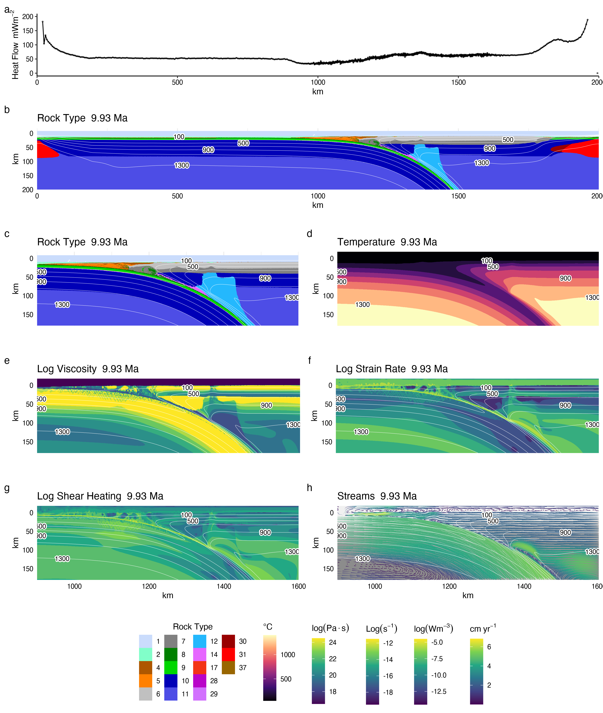
```

\clearpage

# Results

## Coupling depth predictors

Across all 64 numerical models ([@fig:results], Table \ref{tab:zc.results}) coupling depth correlates strongly, but not linearly, with increasing backarc lithospheric thickness ([@fig:biv]a). This correlation is a key result of our experiments. Slab thermal parameter alone does not correlate obviously with coupling depth ([@fig:biv]b). Considering standard least squares regressions of all possible permutations of the variables $z_{1100}$, $z_{1100}^{2}$, and $\Phi$, the following equation optimizes the number of parameters, p value, and $R^{2}$:

$$\begin{aligned}z_{c} = 4.95 \times 10^{- 3}z_{1100}^{2} - 9.27 \times 10^{- 2}\Phi + 63.6\end{aligned}$$ {#eq:zc}

where $z$ is in $km$ and $\Phi$ is in $km/100$. Regression results are provided in Tables \\ref{tab:anova} and \\ref{tab:reg.summary} and show that alternative linear and quadratic models of $z_c$ vs. $z_{1100}$ and $\Phi$ fit the experiments well. [@eq:zc] permits the prediction of the mechanical coupling depths in modern subduction zones where $z_{c}$ can be inverted from heat flow and $\Phi$ is estimated.

```{r results, out.width='100%', fig.cap='Visual table of coupling depth as determined across a range of lithospheric thicknesses and thermal parameters. Note that the thermal parameter axis is not linear. Corresponding experiments are listed along the top of the array. Coupling depth increases systematically with increasing backarc lithospheric thickness (change in grayscale down columns) for all models. Any trend in coupling depth with respect to slab thermal parameter (change in grayscale across rows) is less apparent.'}
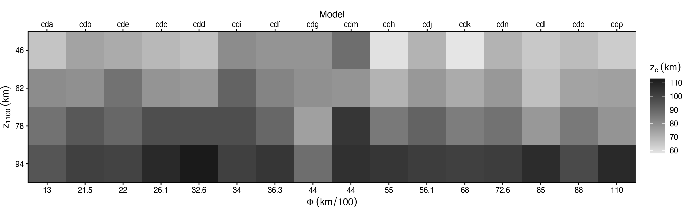
```

```{r zc.results}
d <- mods %>%
  select(model, z1100, phi, zc)
  kable(list(
    d[1:16,],
    d[17:32,],
    d[33:48,],
    d[49:64,]
  ),
  col.names = c('Model', '$z_{1100}$', '$\\Phi$', '$z_c$'),
  caption = 'Numerical modelling results',
  escape = F,
  booktabs = T,
  format = 'latex') %>%
    landscape() %>% 
    kable_styling(latex_options = c("striped"), font_size = 8) %>%
    kable_classic()
    # as_image(file = '../tables/zc.results.png', width = 9)
```

In plots of lithospheric thickness vs. slab thermal parameter ([@fig:multiv]a-c), contours of coupling depth are shallowly sloped, indicating that lithospheric thickness is more important than slab thermal parameter in predicting coupling depth. Predicted coupling depth for 17 modern subduction segments where backarc heat flow data are adequate for inverting for lithospheric thickness (Table \ref{tab:segs}, [@fig:multiv]d) show a wide range of predicted coupling depths, similar to our model simulations. Predicted coupling depths for modern subduction zones are distributed quasi-normally, with a mean of $\sim$ 82 $km$ and variation of $\pm$ 14 $km$ (2$\sigma$ [@fig:multiv]d).

```{r biv, out.width='100%', fig.cap='Bivariate regressions. (a) Coupling depth vs. lithospheric thickness shows coupling depth increasing nonlinearly with increasing backarc lithospheric thickness, which is best fit by a quadratic curve. The correlation is highly significant (see Tables \\ref{tab:anova} and \\ref{tab:reg.summary}) and explains more than 80\\% of the variance in coupling depth. Lithospheric thickness alone predicts coupling depth well (Tables \\ref{tab:anova} and \\ref{tab:reg.summary}). (b) Coupling depth vs. slab thermal parameter shows no significant correlation (the slope is not significantly different than zero, Table \\ref{tab:reg.summary}). The thermal state of the slab has little effect on coupling depth and cannot be used as a standalone predictor.'}
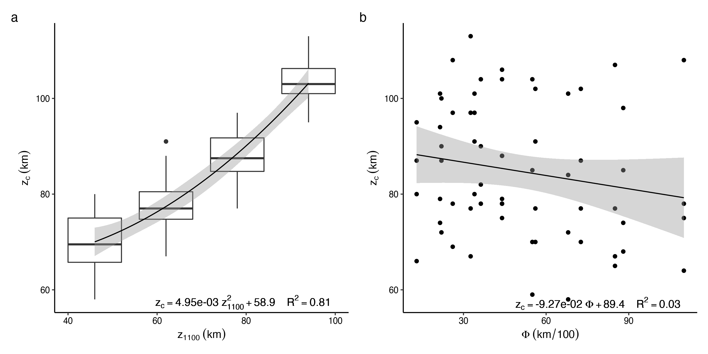
```

```{r segs}
segs %>%
  mutate(ref = c(rep(1, 6), 2, rep(1, 10))) %>%
  select(segment, qs, z1100, phi, zc.lin, zc.quad1, zc.quad2, ref) %>%
  mutate('phi' = round(phi, 1), 'zc.lin' = round(zc.lin), 'zc.quad1' = round(zc.quad1), 'zc.quad2' = round(zc.quad2)) %>%
  kbl(col.names = c('', '$mWm^{-2}$', '$km$', '$km/100$', '$km$', '$km$', '$km$', ''),
      caption = 'Predicted coupling depth for modern subduction zones',
      escape = F,
      booktabs = T,
      format = 'latex') %>%
  add_header_above(c('Segment', '$q_s^a$', '$z_{1100}$', '$\\\\Phi^b$', '$z_c^c$', '$z_c^d$', '$z_c^e$', 'Ref$^f$'), escape = F) %>%
  kable_styling(latex_options = c("striped"), font_size = 8) %>%
  kable_classic() %>%
  footnote(alphabet = c('Avg. backarc heat flow from Currie \\\\& Hyndman (2006)', '$\\\\Phi=age \\\\cdot convergence~velocity$; applicable to Equation 4',  '$z_c=z_{1100}+\\\\Phi$', '$z_c=z_{1100}^2+\\\\Phi$', '$z_c=z_{1100}+z_{1100}^2+\\\\Phi$', '1=Currie \\\\& Hyndman (2006), 2=Wada \\\\& Wang (2009)'), escape = F, general_title = '')
  # as_image(file = '../tables/zc.modern.png', width = 9)
```

```{r multiv, out.width='100%', fig.cap='Multivariate regressions and predicted coupling depths for present-day arc segments. Contour plots show predicted coupling depths (contours) as a function of slab thermal parameter and lithospheric thickness for linear (a) and quadratic (b, c) regressions, where (b) is the best fit regression (Equation 6, see Tables \\ref{tab:anova} and \\ref{tab:reg.summary}). Each black square data point represents a numerical model, and white dots are the predicted coupling depths for modern-day subduction zones (Table \\ref{tab:segs}). Coupling depth strongly depends on lithospheric thickness, regardless of the regression. Subduction systems with similar thermal parameters can have quite different predicted coupling depths (e.g., Alaska vs. N. Sumatra), while subduction systems with quite different thermal parameters can have quite similar predicted coupling depths (e.g., Kamchatka vs. N. Cascadia) (d) Distribution of predicted coupling depths for the 17 modern subduction zones shown in (a), (b), and (c). These 17 segments span a large range of thermal parameters but are predicted to have coupling depths of 82 $\\pm$ 14 $km$.'}
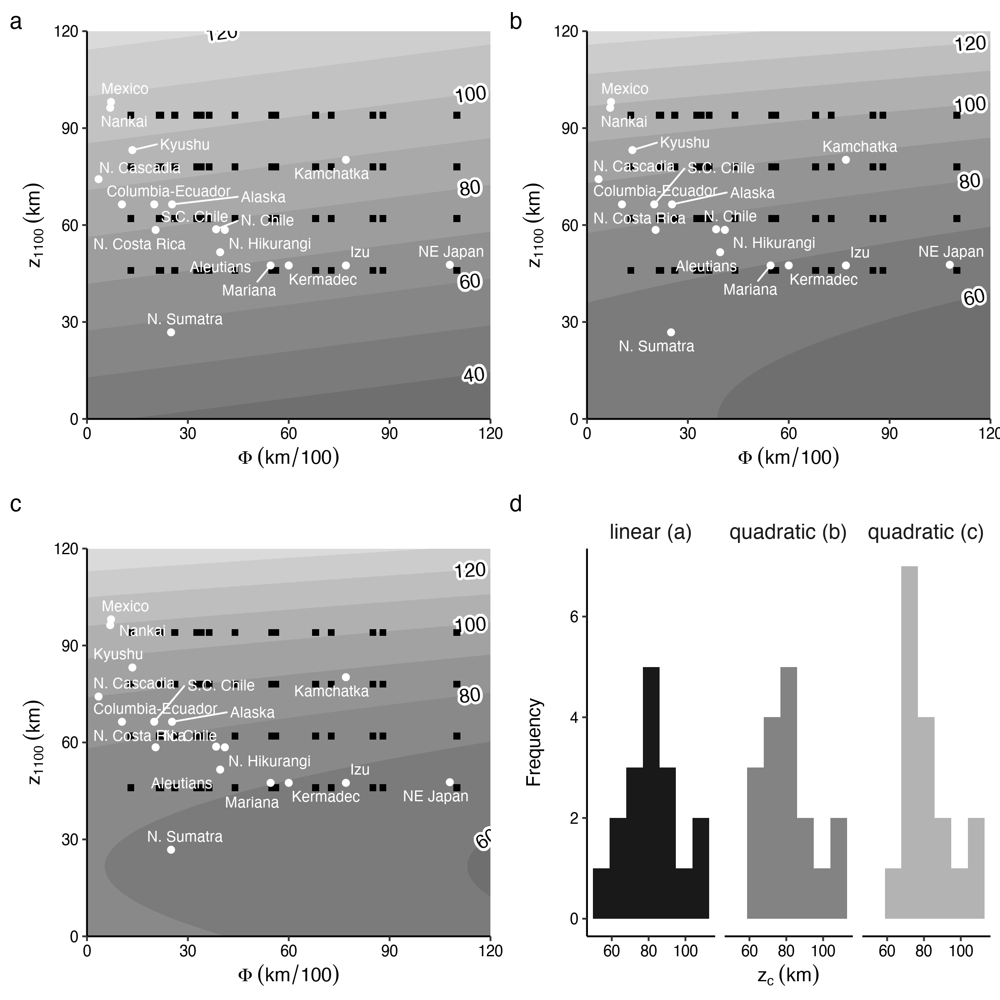
```

\clearpage

## Surface heat flow

Calculated surface heat flow for numerical models with low to moderate slab thermal parameters ([@fig:hf]) stabilize at uniform values in the backarc region, which reflect initial steady-state backarc geotherms. However, all numerical models show some high-amplitude and high-frequency positive deviations in heat flow within the arc and backarc regions ([@fig:hf]), especially for the oldest slabs with the highest convergence rates (highest $\Phi$). These deviations correspond to strong extensional deformation and heat transport via lithospheric thinning and melt migration. The effect of fluid and melt migration is most apparent as subvertical low viscosity, high strain rate columns above the coupling point ([@fig:comp]e, f). The backarc is unaffected by fluid and melt migration, making it the best choice for inverting lithospheric thickness from heat flow. Heat flow deviations in the arc and backarc regions underscore the importance of characterizing extensional deformation and local advective heat transport by fluids before attempting to invert backarc lithospheric thickness from surface heat flow.

A comparison of surface heat flow across numerical models with identical slabs, but varying backarc lithospheric thickness (model cdf with 46, 62, 78, and 94 $km$-thick lithospheres) shows very similar values of heat flow in the forearc (normalized distance $\leq$ 0.75, [@fig:hf78]). In contrast, surface heat flow in the near-arc to backarc (normalized distance $>$ 0.75; [@fig:hf78]) disperses systematically and reflects initial steady-state continental geotherms (i.e. lithospheric thickness). In nature, surface heat flow will depend on fault slip rates and rates of volcanic outputs, especially in the forearc and arc regions. However, heat flow in the backarc may remain in steady-state if rates of volcanism and crustal thinning by extension are low.

```{r hf, out.width='100%', fig.cap='Surface heat flow vs. normalized distance for numerical models with backarc lithospheric thicknesses of 46, 62, 78, and 94 $km$. Normalized distance is the true distance relative to the trench divided by the distance between the arc and trench. Heat flow is colored according to the slab thermal parameter. High amplitude fluctuations in heat flow in the arc region (normalized distance = 1.0) correspond to vertical migration of fluids and melts. In the backarc region, these fluctuations correspond to backarc extension associated with the oldest and fastest-moving slabs (lighter gray lines). Models with no extension fall within a narrow range of surface heat flow values in the backarc region (darker gray lines).'}
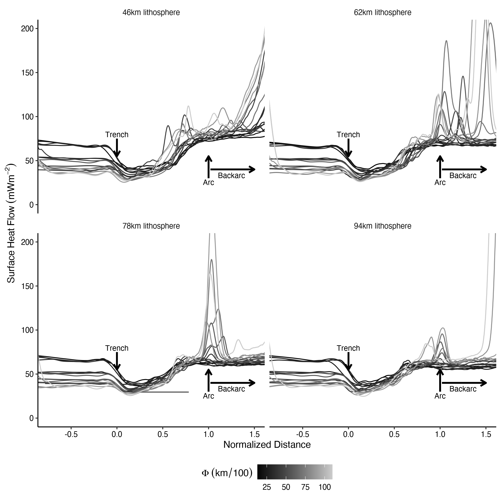
```

\clearpage

# Discussion

## Reaction Mechanism and Thermal Controls on Slab-Mantle Mechanical coupling

In our numerical experiments, slab-mantle mechanical coupling is spatially associated with the reaction of (weak) antigorite to form (stronger) wet olivine. An antigorite-rich serpentinized subduction channel spontaneously forms atop the dehydrating slab, localizing strain, lubricating the slab-mantle interface, and mechanically decoupling the slab and mantle wedge [e.g., @Agard2016; @Ruh2015]. As anticipated, it is the viscosity increase resulting from the transformation of antigorite that causes slab-mantle mechanical coupling in our models, where the depth of this reaction is primarily controlled by a balance of competing thermal feedbacks acting in the upper plate. Cooling and hydration of the upper lithospheric mantle wedge (antigorite stabilization) and heating from the lower circulating asthenospheric mantle wedge (antigorite destabilization) compete to fix the antigorite-out reaction at depth ([@fig:arrows]).

```{r hf78, out.width='80%', fig.cap='Surface heat flow vs. normalized distance for model cdf with backarc lithospheric thicknesses ranging from 46 to 94 $km$. The range of surface heat flow values in the forearc (normalized distance between 0.0 and 1.0) is narrow and shows little variance until near the arc (normalized distance between 0.75 and 1.0). Surface heat flow broadly disperses in the backarc (normalized distance $>$ 1.0) and reflects the initial continental geotherm (lithospheric thickness). A simple relationship between surface heat flow and lithospheric thickness may be obscured in any region experiencing an addition of heat from extension or vertical migration of fluids, especially within the arc-region.'}
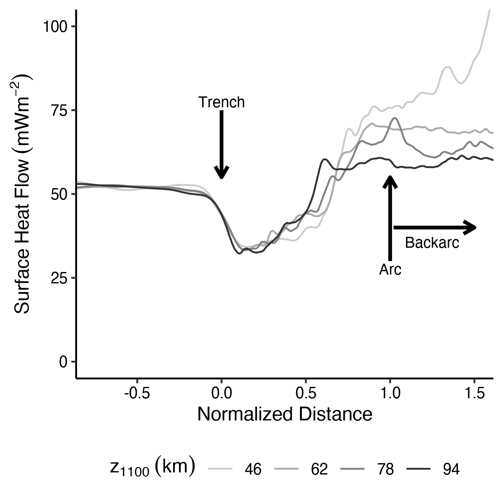
```

The entire process can be conceptualized as follows. Cooling of the mantle wedge occurs mainly via diffusive heat loss to the slab along the entire length of the subducted slab-top ([@fig:arrows]a). At shallow levels, water released from the slab stabilizes serpentine in the overriding mantle, effectively decoupling the slab mechanically from the mantle ([@fig:arrows]b, point a). This mechanical decoupling promotes antigorite stabilization to greater depths because the mantle wedge stagnates and continues to cool and receive water from the dehydrating slab---a positive feedback for the formation of serpentinite. Only a thin layer of serpentine forms at the slab-mantle interface in our models, but it is sufficient to mechanically decouple the slab and mantle.

At deeper levels, beyond the stability of antigorite, diffusive heat loss from the mantle to the slab forms a thickening layer of high-viscosity mantle atop the slab ([@fig:arrows]b, point b). Downward motion of the slab, plus accreated high-viscosity mantle, ([@fig:arrows]b, point b) relative to the deepest extent of the stiff forearc mantle ([@fig:arrows]b, point c) creates a pressure gradient that attracts flow of the weakest materials---serpentinite from the up-dip direction ([@fig:arrows]b, point d)---and hot mantle from below ([@fig:arrows]b, point e). Flow of hot mantle into the necking region between points b and c is analogous to passive asthenospheric upwelling toward a mid-ocean ridge where two strong cooling lithospheric plates diverge. Highly efficient heat advection from the warm mantle wedge core ([@fig:arrows]a) prevents formation of sperentine---thus limiting and stabilizing the coupling depth.

Thermal and petrologic feedbacks---the addition of water into a diffusively cooling, shallow mantle to produce serpentine vs. the advection of heat from the deeper mantle to prevent it---drive coupling towards steady-state. Our results imply a finely-tuned balance of serpentine stability can maintain coupling depths in subduction zones for 10's of Ma.

## The impact of $z_{1100}$ and $\Phi$ on coupling

How does backarc lithospheric thickness ($z_{1100}$) influence coupling depth? The lithosphere-asthenosphere boundary of the upper plate defines the permissible flow field of circulating upper mantle, limiting highly efficient heat advection to below the base of the mechanical lithosphere ([@fig:streams]a-d). Thin upper plate lithospheres ([@fig:streams]a, b) permit shallower mantle wedge circulation and advection of heat farther up the subduction interface. This shallow circulation raises the depth of the serpentine breakdown reaction and mechanical coupling. Thick upper plate lithospheres ([@fig:streams]c, d) restrict mantle wedge circulation and advection of heat to deeper levels, shifting the serpentine breakdown reaction and mechanical coupling to greater depths.

In our models, the thermal state of the slab, as represented by the thermal parameter ($\Phi$), has almost no effect on the mechanical coupling depth. Previous studies of modern subduction zones also concluded that coupling appears to be insensitive to slab age and convergence velocity [@Furukawa1993; @Wada2009]. The likely reason that $\Phi$ makes so little difference is because slab dynamics induce a negative feedback between diffusive cooling and advective heating. High-$\Phi$ slabs (older slabs with higher velocities) cool the mantle wedge more effectively, but also result in stronger mantle circulation and greater heat advection. In contrast, low-$\Phi$ slabs (younger slabs with lower velocities) are less effective in cooling the mantle wedge, but also result in weaker mantle circulation and less heat advection. That is, the shallow vs. deep impacts of $\Phi$ tend to cancel each other, explaining the lack of strong correlation between coupling and thermal parameter.

```{r arrows, out.width='100%', fig.cap='Visualization of temperature, viscosity, and velocity near the coupling region at $\\sim$ 10 $Ma$ for model cdf with lithospheric thickness of 78 $km$. Velocity arrows are relative to the model boundaries, so the upper mantle wedge has a leftwards velocity equal to the velocity of the upper plate, but is stagnant with respect to itself. (a) High-velocity mantle flow occurs only beneath the lithospheric base (1100$^{\\circ}C$), transfering heat towards the coupling region. (b) Log viscosity indicates coupling at the point where the viscosity contrast between the slab and mantle approaches zero. Reference points a-e are used for discussing reaction mechanisms and thermal feedbacks during the transition to slab-mantle mechanical coupling.'}
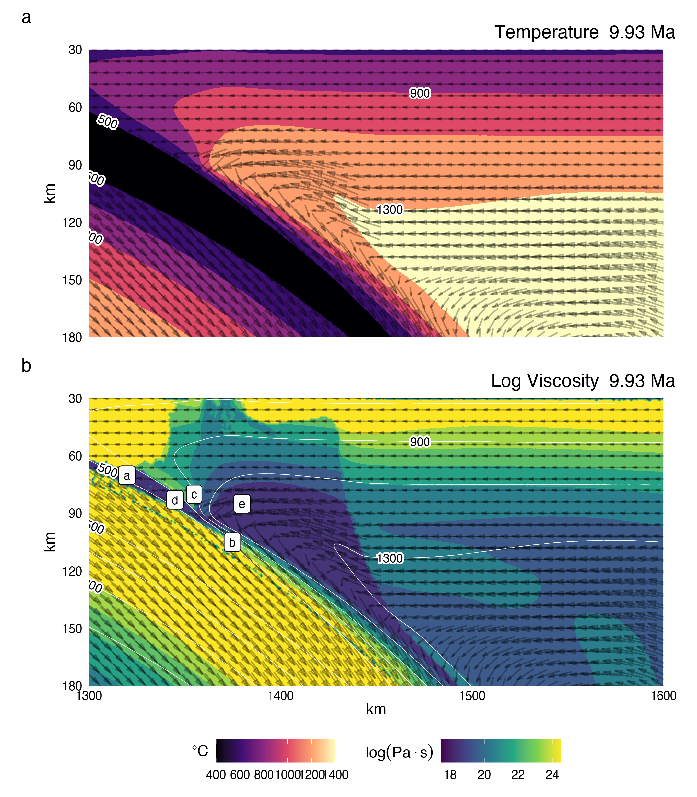
```

\clearpage

## Predicting Coupling Depths in Subduction Zones

Theoretically, coupling depth can be predicted directly from forearc heat flow using forward modelling techniques to fit surface heat flow data [e.g., @Wada2009]. However, we caution against using fore-arc heat flow data because a) forward models adjust the mechanical coupling depth independently from the backarc thermal structure, which is inconsistent with the inherent link between mechanical coupling and backarc thermal structure discussed above (e.g., [@fig:hf78; @fig:streams]), and b) shear heating and crustal plutonism can contribute to surface heat flow in the forearc [@Gao2014; @ReesJones2018],
complicating any simple correspondence with coupling depth.

Instead, we recommend predicting mechanical coupling depth in modern subduction zones based on [@eq:zc], estimates of backarc lithospheric thickness (as estimated from backarc heat flow), and slab thermal parameter. The slab thermal parameter is inventoried for most subduction zone segments [@Syracuse2006], but a corresponding dataset of lithospheric thicknesses does not exist. Several geophysical and petrologic methods might be considered for independent estimates of lithospheric thickness (e.g., seismic velocities, flexure, heat flow, mantle xenoliths, etc.), but we prefer to focus on backarc surface heat flow because of its correspondence with thermal structure. In this approach, backarc lithospheric thickness is estimated using simple one-dimensional heat transport models assuming values for radiogenic heat production in the crust [e.g., @Rudnick1998]. That is, one can use compiled backarc heat flow data to invert for backarc lithospheric thickness, calculate the slab thermal parameter from the product of slab age and convergence velocity, and apply [@eq:zc] to estimate mechanical coupling depth. Of course, care must be taken to avoid backarcs with strong extensional deformation or conspicuous heating from magmatism because heat flow in these regions will underestimate backarc lithospheric thickness and consequently underestimate coupling depth.

```{r streams, out.width='100%', fig.cap='Streamlines for the standard model, cdf, with backarc lithospheric thickness of (a) 46, (b) 62, (c) 78, and (d) 94 $km$. All models are visualized at $\\sim$ 10 $Ma$ and plotted on the same scale and location within the model domain. The flow of warm mantle is restricted to below the 1100$^{\\circ}C$ isotherm, which corresponds to the base of the backarc lithosphere. A minimum coupling depth appears to exist as models with extremely thin lithospheres (a) exhibit coupling at $\\sim$ 70-80 $km$ depth, but increasing $z_{1100}$ increases coupling depth as mantle flow and advective heat transport are diminished.'}
knitr::include_graphics('figs/fig10.png')
```

\clearpage

## A Common Coupling Depth Globally?

Mechanical coupling depths in subduction zones are commonly assumed to fall within a narrow range of 70-80 $km$ [@Wada2009; @Syracuse2010]. We tested the correlation between backarc lithospheric thickness and coupling depth using the natural dataset compiled by @Wada2009 ([@fig:multiv]d). Much of their dataset is based on @Currie2006, who infer backarc lithospheric thicknesses for 10 circum-Pacific subduction zones of 50-60 $km$ (as defined by the 1200 $^{\circ}C$ isotherm). Backarc lithospheres are inferred to be relatively thin from uniformly high heat flow ($>$ 70 $mW/m^{2}$), thermobarometric constraints on mantle xenoliths, and P-wave velocities [@Currie2006]. The mean value of 82 $\pm$ 14 $km$ (2$\sigma$) for mechanical coupling depths in our analysis ([@fig:multiv]d) roughly matches the preferred depth inferred from forearc heat flow data for Cascadia and NE Japan [75-80 $km$, @Syracuse2010; @Wada2009] $km$, but our predicted coupling depths ([@fig:multiv]d) are distributed more broadly. For example, omitting Mexico and Nankai because their $\Phi$ values fall outside our modeling domain, predicted coupling depths range from almost 100 $km$ (Kyushu) to $\sim$ 65 $km$ (Sumatra and NE Japan, Table \ref{tab:segs}).

The petrologic record may also provide insight into the consistency of a mechanical coupling depth. As it approaches the mechanical coupling depth, the serpentine channel narrows and focuses return flow. The demise of the serpentine channel at greater depths may provide a natural barrier such that rocks within the serpentine channel are more likely to be exhumed than rocks below the channel. If so, the abundance of blueschists and eclogites whose maximum burial depths are less than the pinchout of the serpentine channel, i.e., at the mechanical coupling depth, should be greater than rocks with greater maximum burial depths. A cumulative probability distribution of data compiled by @Penniston2015 shows a distinct kink at an inferred depth of $\sim$ 80 $km$ ([@fig:pd15]). Rocks whose peak metamorphic pressures correspond with depths $\leq$ 80 $km$ are much more likely to be exhumed than rocks metamorphosed at depths $>$ 80 $km$. In fact, nearly all examples of rocks exhumed from greater depths in the compilation of @Penniston2015 were exhumed in the context of collisions. Logically, the metamorphic record supports a common mechanical coupling depth of $\leq$ 80 $km$.

Relatively high backarc heat flow, especially in circum-Pacific subduction zones, suggests relatively stable and uniformly thin backarc lithospheres in mature subduction zones globally that may in turn cause a common depth of slab-mantle coupling. Although we do not yet fully understand why the overriding plates may have similar thicknesses, we can assume that this is likely related to some processes of lithospheric erosion proposed for subarc lithosphere [e.g., @Arcay2006; England2010; @Sobolev2005]. The following mechanisms of lithospheric erosion have been proposed: lithospheric delamination induced by lower crust eclogitization [e.g., @Sobolev2005], small-scale convection caused by hydration-induced mantle wedge weakening [e.g., @Arcay2006], thermal erosion [e.g., @England2010] and mechanical weakening [e.g., @Gerya2011] by percolating melts and subarc foundering of magmatic cumulates [e.g., @Jull2001]. Most of these mechanisms are thus strongly related to mantle wedge hydration, melting, and melt transport toward volcanic arcs.

# Conclusions

Four important results are highlighted in this study:

1. The antigorite to olivine dehydration reaction stabilizes where balance is achieved between competing thermal feedbacks within the stagnant mantle wedge lithosphere (diffusive heat loss and inefficient heat advection) and circulating mantle wedge asthenosphere (highly efficient and focused heat advection). The depth of this reaction, and thus mechanical coupling, is primarily dependent on the mechanical thickness of the backarc lithosphere.

2. A simple expression fitted to the results of our numerical models allows the mechanical coupling depth to be calculated for subduction zone segments with adequate surface heat flow data in the backarc region. Back-arc lithospheric thickness can be inferred from surface heat flow using a one-dimensional steady-state conductive cooling model. Together with slab thermal parameter , which is tabulated for nearly all subduction segments worldwide [@Syracuse2006; @Syracuse2010], coupling depth can be calculated using [@eq:zc].

3. Consistently high backarc heat flow in circum-Pacific subduction zones [@Currie2006; @Wada2009] may indicate a common depth of slab-mantle mechanical coupling globally at ca. 80 $km$. Prior assumptions of slab-mantle mechanical coupling at 70-80 $km$ in thermal models are broadly consistent with our results.

4. As others have proposed [@Currie2006; @Wada2009] subduction zones may self-organize into stable configurations globally with warm (thin) upper plate lithospheres and slab-mantle mechanical coupling at depths of ca. 80 $km$. Questions remain, however, including: 1) How do warm (thin) backarcs persist over 100's of kilometers throughout the lifespan of subduction zones? 2) How abrupt is the antigorite-out reaction along the subduction interface?, and 3) How can predictive models like [@eq:zc] be improved using natural datasets? We propose these questions as topics for future research.

\clearpage

\appendix
\section{Appendix}

## Subduction duration to achieve steady state

In our models, the stability depth of antigorite along the slab-mantle interface increases with time as the subducting slab cools and hydrates the mantle wedge. We observed this process for the first 5 $Ma$ of subduction with the antigorite stability depth remaining constant for ca. 10 $Ma$ afterwards ([@fig:antdepth]). The change in the antigorite stability depth, and therefore the slab-mantle mechanical coupling depth, through ca. 10 $Ma$ emerges self-consistently in our models and can help explain how similar configurations, in terms of the depth to the slab beneath arcs [@England2004] and thin backarc lithospheres [@Currie2006], occur in subduction zones with different slab ages, convergence rates, geometries, and subduction durations. Our modelling results indicate that subduction zones quickly ($<$ 5 $Ma$) develop and stabilize quasi-permanent, generalized configurations with a slab-mantle mechanical coupling depth dependent on the thickness of the backarc lithosphere.

Exceptions occur in our models with the thinnest backarc lithospheres ($z_{1100}$ = 46 $km$), which exhibit transient behavior after ca. 5 $Ma$ ([@fig:antdepth]). These models rapidly ($<$ 5 $Ma$) develop spreading centers in the backarc because of their extremely thin (weak) backarc lithospheres. The proximity of a spreading center in the backarc region diverts heat from the circulating mantle wedge and interferes with the development of a stable antigorite breakdown location compared to systems that do not develop a backarc spreading center. In principle, diversion of heat to the backarc could lead to cooler subducting slabs (less heat advection) and deeper coupling. This hypothesis may be tested by artificially increasing the strength of the backarc lithosphere for models with very thin backarc lithospheres to prevent high rates of backarc spreading.

```{r antdepth, out.width='100%', fig.cap='The depth of antigorite stability at the slab-mantle interface vs. time for models with 46, 62, 78, and 94 $km$-thick backarc lithospheres. Antigorite stabilization deepens for the first ca. 5 $Ma$ of subduction and then remains roughly constant for ca. 10 $Ma$. The exceptions are models with very thin backarc lithospheres, which exhibit transient behavior for at least 15 $Ma$. The final achieved stability depth of antigorite increases with increasing backarc lithospheric thickness.'}
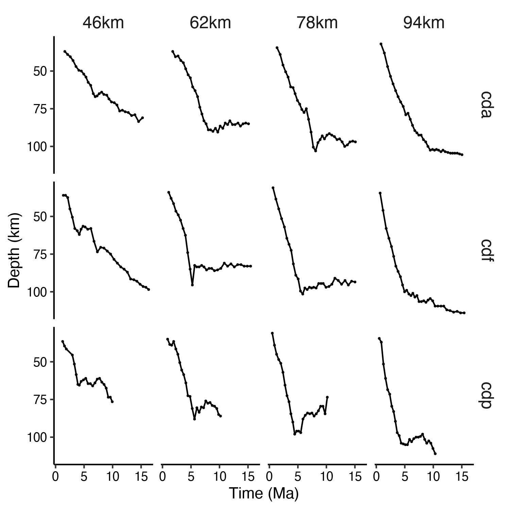
```

\clearpage

## Absolute minimum coupling depths?

The form of our preferred quadratic regression model shows shallowing of coupling depths decelerating with progressively thinner upper plate lithospheres, reaching a minimum of ca. 60 $km$. This implies that the antigorite-out reaction should eventually stabilize at $\geq$ 60 $km$ depth even during nascent subduction and in warm systems with thin upper plate lithospheres. From a theoretical point of view, a thin upper plate lithosphere could allow high heat transport to the shallow mantle wedge and hinder stabilization of antigorite altogether. Olivine plus pyroxene would be the stable mantle minerals, and strong, shallow coupling between plates would be expected @Gerya2008. However, our models show that even the warmest subduction systems eventually stabilize antigorite in the shallow mantle wedge. This is evident by the increasing depth of mechanical coupling with time for the first 5 $Ma$ of subduction ([@fig:antdepth]).

```{r pd15, out.width='80%', fig.cap='Cumulative probability versus peak metamorphic pressures for metamorphic rocks exhumed from subduction zones. The break in slope at ca. 2.5 $GPa$ (ca. 80 $km$) suggests that the relative probability that a rock will exhume from pressures less than ca. 2.5 $GPa$ is substantially greater (steeper slope) than for higher pressure rocks (shallower slope). Nearly all rocks exhumed from pressures greater than ca. 2.5 $GPa$ derive from continental crust and were exhumed during collision. Paucity of data below 0.5 $GPa$ reflects sampling bias because these rocks are at best incipiently metamorphosed and not conducive to thermobarometry.'}
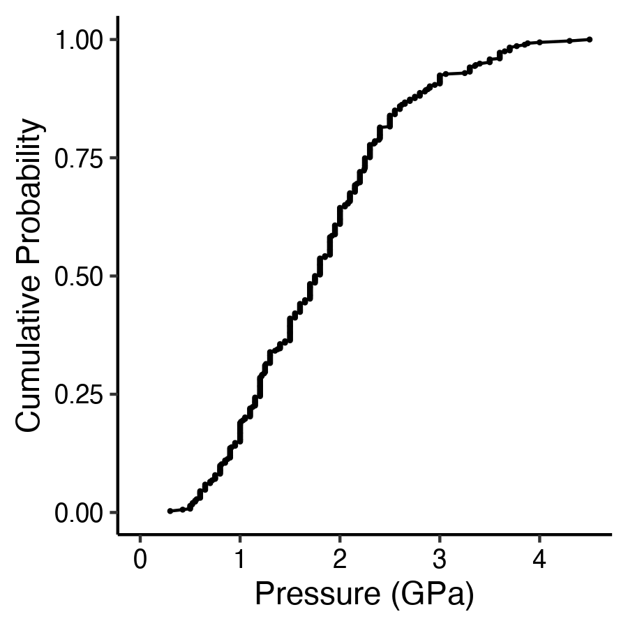
```

```{r anova}
bvm.z1100.lin$anova %>%
  select(-null.value) %>%
  mutate('estimate' = round(estimate, 1),
         'conf.low' = round(conf.low, 1),
         'conf.high' = round(conf.high, 1),
         'adj.p.value' = scientific(adj.p.value, digits = 3),
         'term' = '$z_{1100}$') %>%
  kbl(col.names = c('', '', '$km$', '$km$', '$km$', ''),
      booktabs = T,
      caption = 'Summary of ANOVA test',
      format = 'latex',
      escape = F) %>%
  add_header_above(c('Term', 'Contrast', 'Estimate', 'Upper Bound', 'Lower Bound', 'p value'),
                   escape = F,
                   line = F) %>%
  kable_classic() %>%
  kable_styling(latex_options = c("striped"), font_size = 8) %>%
  footnote(general = c("Pair-wise Tukey's test comparing means between groups. Estimates are differences between means. Null hypothesis is that means are not different"),
           threeparttable = T,
           escape = F,
           general_title = '')
  # as_image(file = '../tables/anova.png', width = 9)
```

```{r reg.summary}
map_df(list(bvm.phi.lin,
         bvm.z1100.lin,
         bvm.z1100.quad1,
         bvm.z1100.quad2,
         mvm.lin,
         mvm.quad1,
         mvm.quad2),
    ~.x$model, .id = 'reg') %>%
  select(-statistic) %>%
  mutate('estimate' = round(estimate, 1),
         'std.error' = round(std.error, 1),
         'p.value' = scientific(p.value, digits = 3),
         'term' = ifelse(term == 'phi', '$\\phi$',
                         ifelse(term == 'z1100', '$z_{1100}$',
                                ifelse(term == 'z1100^2', '$z_{1100}^2$', term)))) %>%
  kbl(col.names = c('Model', 'Term', 'Estimate', 'Std. Error', 'p value'),
      booktabs = T,
      caption = 'Summary of regression models',
      format = 'latex',
      escape = F) %>%
  kable_styling(latex_options = c("striped"), font_size = 8) %>% 
  kable_classic() %>%
  footnote(general = c('1=$z_c$=$\\\\phi$, 2=$z_c$=$z_{1100}$, 3=$z_c$=$z_{1100}^2$, 4=$z_c$=$z_{1100}+z_{1100}^2$, 5=$z_c$=$z_{1100}+\\\\phi$, 6=$z_c$=$z_{1100}^2+\\\\phi$, 7=$z_c$=$z_{1100}+z_{1100}^2+\\\\phi$'),
           threeparttable = T,
           escape = F, general_title = '')
  # as_image(file = '../tables/reg.summary.png', width = 9)
```

\clearpage

## (De-)hydration model

The material properties used in our experiments are listed in Tables \ref{tab:materials} and \ref{tab:melts}. For details about the sedimentation and erosion, melting and extraction, and rheological models, please refer to @Sizova2010. Here we discuss only the hydrodynamic model, because it is the most relevant aspect of our results.

The hydrodynamics in our models controls the timing and magnitude of mantle wedge hydration. The main sources of water delivered to the mantle are altered basaltic crust and seafloor sediments, which we assumed to contain up to 5 $wt.\% H_{2}O$. We assumed a gradual expulsion of water from pore space and through quasi-continuous dehydration reactions occurring within the slab. Water content is computed using the following equation:

$$\begin{aligned}\chi_{H_{2}O(wt.\%)} = \chi_{H_{2}O(p_{0})} \times \left( 1 - \frac{\Delta z}{150 \cdot 10^{3}} \right)\end{aligned}$$

where $\chi_{H_{2}O(p_{0})}$=5 $wt.\%$ and $\Delta z$ is a marker's depth below the topographical surface.

If a rock marker dehydrates, an independent water particle is instantaneously generated at the same location with the respective $H_{2}O$ content. The new water particle is moved in accordance to the local velocity field, described by the following equation:

$$\begin{aligned}
v_{\text{water}} & = (v_{x},v_{z}) \\
v_{z} & = v_{z} - v_{z(\text{percolation})} \\
\end{aligned}$$

where $v_{water}$ is the velocity vector of the water particle, $v_{x}$ and $v_{z}$ are the local velocity vectors of the the solid state mantle or crust, and $v_{z(percolation)}$ is a prescribed upward percolation velocity (10 $cm/year$). We implicitly neglect kinetics of reactions, as material properties of markers change instantaneously at equilibrium reactions.

## Approaches for implementing slab-mantle mechanical coupling

Numerical models employ different approaches to simulate the mechanical decoupling-coupling transition along the slab-mantle interface. A simple but highly effective approach is to prescribe a weak layer extending from the surface to some arbitrary depth or temperature that inhibits transfer of shear stress across the slab-mantle interface. This approach is analogous to implementing a no-slip condition and effectively decouples the slab from the mantle. Numerous models use this method [e.g., @Peacock1996; @Peacock1999b; @Wada2009; @Syracuse2010] in part because it allows models to be fine-tuned to specific subduction zone configurations. Serpentine-or talc-rich horizons are typically invoked to justify mechanical decoupling along the shallow interface.

Our approach does not explicitly define slab-mantle mechanical coupling, rather we use a rheologic model that explicitly follows experimentally determined flow laws and mineral stability fields. Conceptually, our approach follows and extends petrologic explanations for a shallow weak interface. At lower temperatures, a hydrated, serpentine-rich, or possibly talc-rich, layer mechanically decouples the mantle wedge from the subducting slab [@Hyndman2003; @Peacock1999a]. If so, as a corollary, dehydration of serpentine, or possibly talc, at high temperatures must strengthen the interface. In that context, and noting that talc is unstable at P $>$ 2.0 $GPa$ in an ultramafic rock [@Schmidt1998] $>$  $GPa$ , we assigned a serpentine rheology for P-T conditions below the serpentine-out reaction, and a wet peridotite rheology above it.

To test the sensitivity of coupling on our rheologic model, we ran diverse experiments that adjusted the rheology of antigorite, the shape and position of the antigorite-out reaction, and certain hydrodynamic parameters. For brevity, these results are not presented here. The experiments included: 1) antigorite = wet olivine flow law, 2) antigorite and wet olivine = dry olivine flow law, 3) isothermal antigorite reaction (straight, vertical reaction line) at 690 $^{\circ}C$, 4) antigorite reaction with positive nonlinear Clapeyron slope until 715 $^{\circ}C$, where it changes to isothermal (kinked reaction line), 5) linear antigorite reaction with positive Clapeyron slope (straight, sloped reaction line), 6) linear release of antigorite-bound $H_{2}O$ with depth (instead of abrupt release at equilibrium dehydration reaction), and 7) no fluid-induced weakening (pore-pressure = 0).

Only experiments 5 and 7 listed above were inconsistent with the results presented in the present study. Experiment 5 resulted in transient coupling depths and disjointed antigorite stability in the mantle wedge, whereas experiment 7 resulted in two-sided subduction [e.g., @Gerya2008]. These experiments suggest that the coupling mechanism in our models is mostly contingent on the availability of fluids to the mantle wedge and the shape of the equilibrium antigorite reaction, and relatively insensitive to the exact flow law parameters.

```{r cdfstep1, out.width='80%', fig.cap='Visualizations of standard model cdf78 at 1.64 Ma. (a) Rock type. (b) Temperature. (c) Log$_{10}$ of viscosity. (d) Streamlines. Early subduction is facilitated by the prescribed initial weak layer cutting the lithosphere. Strain is localized in the weak serpentine layer at the slab-mantle interface. The mantle wedge is stagnant and loses heat to the slab, which promotes antigorite stabiliization to greater depths. Rock type colors are given in Table \\ref{tab:rock.type}.'}
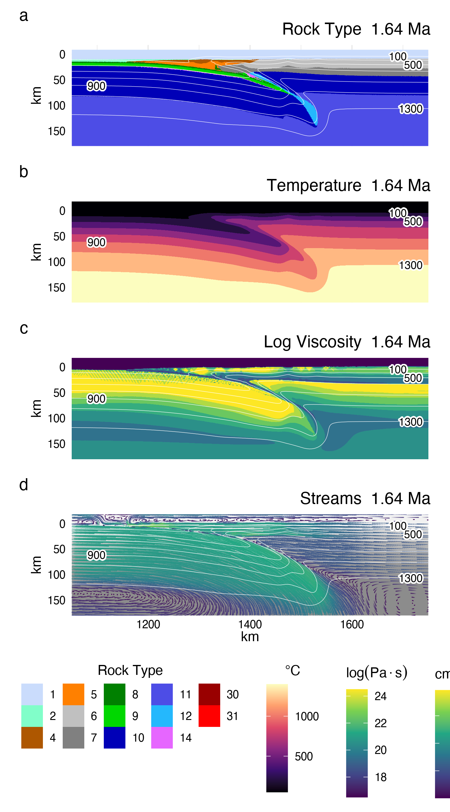
```

```{r cdfstep2, out.width='80%', fig.cap='Visualization s of standard model cdf78 at 5.05 $Ma$. (a) Rock type. (b) Temperature. (c) Log$_{10}$ of viscosity. (d) Streamlines. By 5 $Ma,$ balance is achieved between heat sinking from the upper mantle wedge to lower parts of the mantle and strong advection of heat in the circulating part of the mantle wedge. A feedback has already developed---heat advection inhibits antigorite stabilization to greater depths. Rock type colors are given in Table \\ref{tab:rock.type}.'}
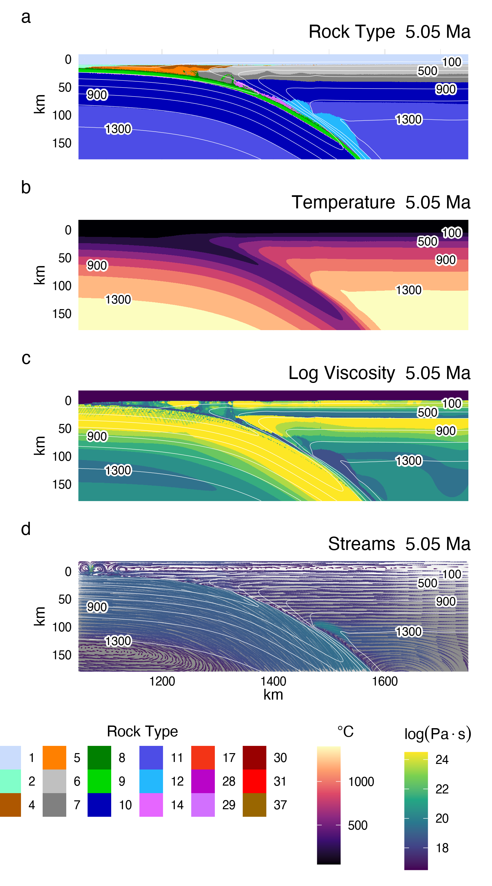
```

```{r cdfstep3, out.width='80%', fig.cap='Visualization s of standard model cdf78 at 9.93 $Ma$. (a) Rock type. (b) Temperature. (c) Log$_{10}$ of viscosity. (d) Streamlines. The geodynamics and thermal structure remain approximately constant from 5 $Ma$ (cf. Figure A.4). The system remains in steady state for as long as enough water is supplied to the upper mantle wedge to stabilize antigorite.Rock type colors are given in Table \\ref{tab:rock.type}.'}
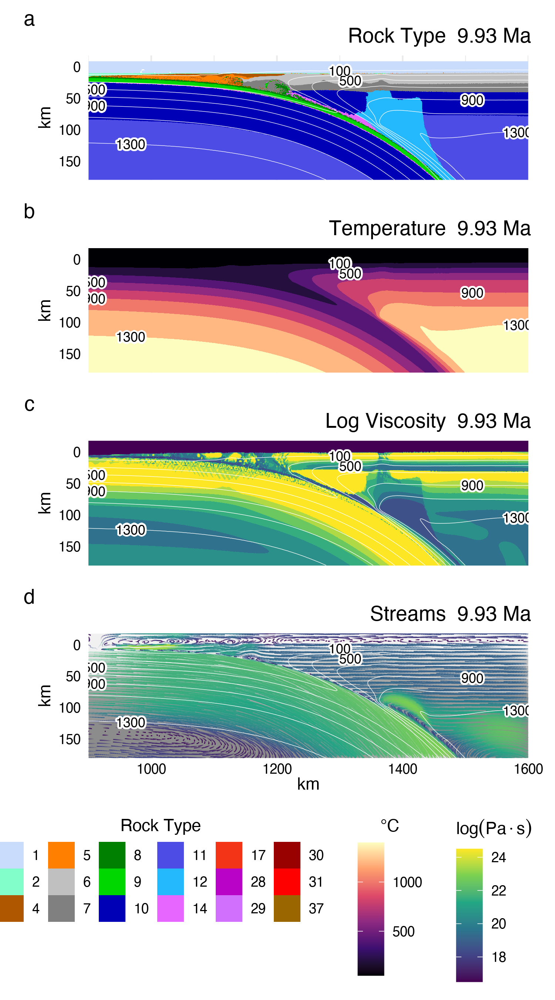
```

\clearpage

\acknowledgments

We thank the Geophysical Fluid Dynamics group at the Institut für Geophysik, ETH Zürich, for their computing resources and invaluable instruction, discussion, and support on the numerical modelling methods. We also thank P. Agard, L. Le Pourhiet, and their students at ISTeP, Sorbonne Université, for suggestions on the numerical modelling methods and discussions that greatly enhanced this study. We thank the anonymous reviewers for their helpful comments and suggestions, which greatly improved the manuscript. This work was supported by the National Science Foundation grant OIA1545903 to M. Kohn, S. Penniston-Dorland, and M. Feineman. Datasets and tools for reproducing the research in this study are available at (`https://doi.org/10.17605/OSF.IO/ZJAC3`)

\newpage

# References